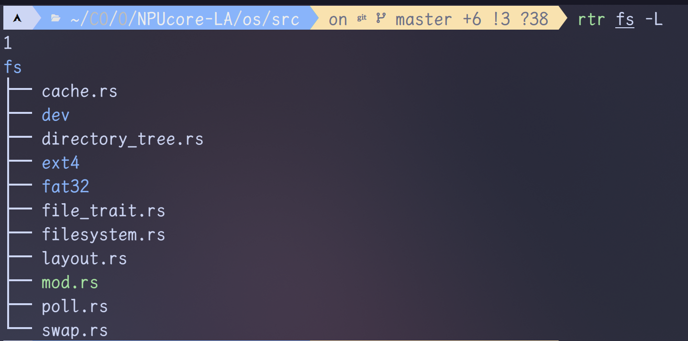
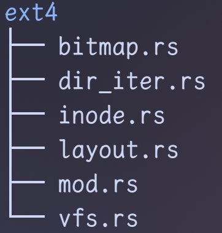
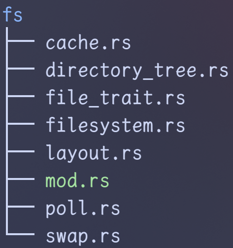
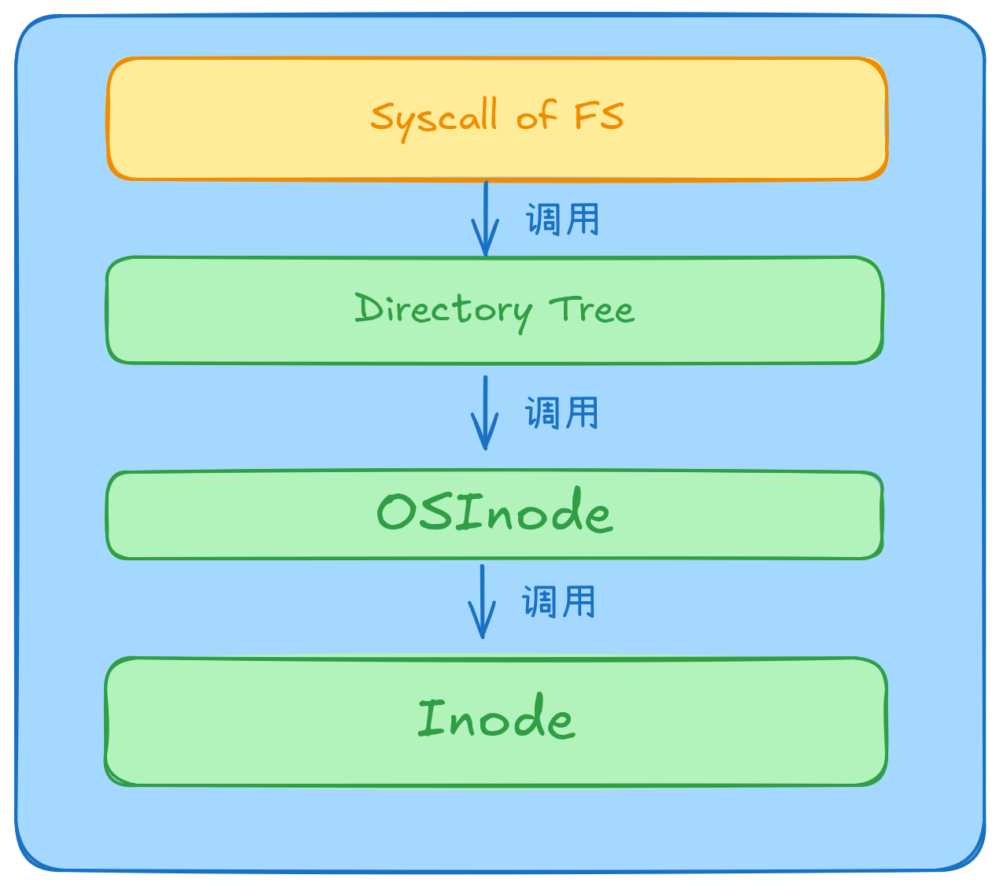

# FS of NPUcore-LA

## 〇、概览

先使用 [rtree](https://github.com/xjimlinx/rtree) (我自己用gpt帮助写的用rust实现的tree简化版)看一下大概



可以看到有fs根目录下有三个文件夹，分别是：

+ **dev** ：放各种特殊设备的代码
+ **fat32** ：放有 fat32 相关的代码
+ **ext4**（我自己加的）

所以依葫芦画瓢，现在ext4下面创建如下结构，后面再慢慢改

```rust
src/fs/ext4
├── bitmap.rs       # 位图操作，用于跟踪已分配/未分配的块
├── dir_iter.rs     # 目录迭代器，用于遍历目录项
├── inode.rs        # 管理inode数据结构，这是EXT4文件系统中的核心
├── layout.rs       # 定义EXT4文件系统在磁盘上的布局
├── mod.rs          # 模块入口，负责初始化EXT4文件系统支持
└── vfs.rs          # 虚拟文件系统接口，将EXT4特定的实现与VFS层对接
```



---

## 一、FS 根文件

然后我们现在先从 `fs` 文件夹下面看看纯文件



---

首先，先看看 `fs/mod.rs` 文件，毕竟是模块声明文件

### 1.1 fs/mod.rs

#### 1.1.1 lazy_static! 段

```rust
lazy_static! {
    pub static ref ROOT_FD: Arc<FileDescriptor> = Arc::new(FileDescriptor::new(
        false,
        false,
        self::directory_tree::ROOT
            .open(".", OpenFlags::O_RDONLY | OpenFlags::O_DIRECTORY, true)
            .unwrap()
    ));
}
```

可以看到创建了一个变量 `ROOT_FD`，类型是 `Arc<FileDesciptor>`，内部的值初始化为`false, false, self::directory::ROOT.open(...).unwrap()`

#### 1.1.2 FileDescriptor 结构体

```rust
#[derive(Clone)]
pub struct FileDescriptor {
    cloexec: bool,	// close on exec
    nonblock: bool,
    pub file: Arc<dyn File>,
}
```

- `cloexec`: 表示这个文件描述符是否应该在执行新的程序（比如通过`exec`系列函数）时关闭。
- `nonblock`: 表示文件描述符是否设置为非阻塞模式。
- `file`: 这是一个实现了`File` trait的对象的引用计数指针（`Arc<dyn File>`），这意味着它可以指向任何实现了`File` trait的具体文件类型。

#### 1.1.3 FdTable 结构体

```rust
#[derive(Clone)]
pub struct FdTable {
    inner: Vec<Option<FileDescriptor>>,
    recycled: Vec<u8>,
    soft_limit: usize,
    hard_limit: usize,
}
```

- `inner`: 一个可选的`FileDescriptor`类型的向量，每个元素代表一个文件描述符，使用`Option`来允许文件描述符被标记为未使用。
- `recycled`: 一个`u8`类型的向量，可能是用来追踪哪些文件描述符编号已经被回收并且可以重新分配。
- `soft_limit` 和 `hard_limit`: 这些可能是指文件描述符的数量限制，软限制是可以修改的限制，而硬限制则是最大上限。

剩下的就是这两个东西的实现了，先暂时不在这里展开

###### ⚠️TODO!

---

### 1.2 fs/file_trait.rs

```rust
pub trait File: DowncastSync {
    // 深度克隆文件对象
    fn deep_clone(&self) -> Arc<dyn File>;
    // 可读
    fn readable(&self) -> bool;
    // 可写
    fn writable(&self) -> bool;
    // 读取数据，返回读取的字节数
    fn read(&self, offset: Option<&mut usize>, buf: &mut [u8]) -> usize;
    // 写入数据，返回写入的字节数
    fn write(&self, offset: Option<&mut usize>, buf: &[u8]) -> usize;
    // 是否准备好读
    fn r_ready(&self) -> bool;
    // 是否准备好写
    fn w_ready(&self) -> bool;
    // 从用户态读取数据，返回读取的字节数
    fn read_user(&self, offset: Option<usize>, buf: UserBuffer) -> usize;
    // 从用户态写入数据，返回写入的字节数
    fn write_user(&self, offset: Option<usize>, buf: UserBuffer) -> usize;
    // 获取文件大小
    fn get_size(&self) -> usize;
    // 获取文件Stat结构
    fn get_stat(&self) -> Stat;
    // 获取文件类型
    fn get_file_type(&self) -> DiskInodeType;
    // 检查文件的类型来判断是否是目录
    fn is_dir(&self) -> bool {
        self.get_file_type() == DiskInodeType::Directory
    }
    // 检查文件的类型来判断是否是普通文件
    fn is_file(&self) -> bool {
        self.get_file_type() == DiskInodeType::File
    }
    // 提供文件的目录树信息
    fn info_dirtree_node(&self, dirnode_ptr: Weak<DirectoryTreeNode>);
    // 获取文件所在的目录树节点
    fn get_dirtree_node(&self) -> Option<Arc<DirectoryTreeNode>>;
    // 打开文件
    fn open(&self, flags: OpenFlags, special_use: bool) -> Arc<dyn File>;
    // 打开子文件（如果是个目录）
    fn open_subfile(&self) -> Result<Vec<(String, Arc<dyn File>)>, isize>;
    // 创建文件
    fn create(&self, name: &str, file_type: DiskInodeType) -> Result<Arc<dyn File>, isize>;
    // 链接一个子文件（用于目录）
    fn link_child(&self, name: &str, child: &Self) -> Result<(), isize>
    where
        Self: Sized;
    /// delete(unlink)
    // 删除文件或解除链接
    fn unlink(&self, delete: bool) -> Result<(), isize>;
    // 获取文件目录项，返回一个包含文件目录信息的Dirent结构（Vec类型）
    fn get_dirent(&self, count: usize) -> Vec<Dirent>;
    // 获取偏移量
    fn get_offset(&self) -> usize {
        self.lseek(0, SeekWhence::SEEK_CUR).unwrap()
    }
    // lseek 文件定位操作
    fn lseek(&self, offset: isize, whence: SeekWhence) -> Result<usize, isize>;
    // 修改文件大小（改变量为diff）
    fn modify_size(&self, diff: isize) -> Result<(), isize>;
    // 截断文件大小（设置量为new_size）
    fn truncate_size(&self, new_size: usize) -> Result<(), isize>;
    // 设置文件时间戳，包含创建时间、访问时间和修改时间
    fn set_timestamp(&self, ctime: Option<usize>, atime: Option<usize>, mtime: Option<usize>);
    // 获取单个缓存页
    fn get_single_cache(&self, offset: usize) -> Result<Arc<Mutex<PageCache>>, ()>;
    // 获取所有缓存页
    fn get_all_caches(&self) -> Result<Vec<Arc<Mutex<PageCache>>>, ()>;
    // 内存溢出时处理
    fn oom(&self) -> usize;
    // 判断是否属于挂起状态
    fn hang_up(&self) -> bool;
    // 设备控制操作，允许直接向设备发送命令
    fn ioctl(&self, _cmd: u32, _argp: usize) -> isize {
        ENOTTY
    }
    // 文件控制操作，用于修改文件描述符的属性
    fn fcntl(&self, cmd: u32, arg: u32) -> isize;
}
impl_downcast!(sync File);
// 这个宏表示 File trait 支持动态类型转换
// 允许在运行时将 dyn File 类型转换为具体类型
```

---

### 1.3 fs/filesystem.rs

#### 1.3.1 lazy_static! 段

一段不知所云的 `lazy_static！` 代码

```rust
lazy_static! {
	static ref FS_ID_COUNTER: Arc<Mutex<usize>> = Arc::new(Mutex::new(0));
}
```

这段代码创建了一个全局的、线程安全的 `FS_ID_COUNTER` 变量，初始化为0。这个计数器被 `Arc` 包裹，以便在多个线程间共享，并且通过 `Mutex` 确保在任何时刻，只有一个线程能够访问或修改计数器的值。

+ `static ref` 是 `lazy_static!` 宏的关键字（由lazy_static!提供），表示声明一个静态的、可变的引用。这个变量会在程序运行时被初始化并且保持全局唯一，直到程序退出。

  - `FS_ID_COUNTER` 是变量的名字，可以被其他代码访问。

  - 由于是静态变量，Rust 会确保在整个程序生命周期内只有一个 `FS_ID_COUNTER` 实例存在，并且它在多线程环境下是安全的。

- `Arc<Mutex<usize>>` 是 `FS_ID_COUNTER` 的类型，下面是它的具体含义：
  - **Mutex**：`Mutex` 是一种互斥锁，用于保证数据在多线程环境中的安全访问。只有一个线程可以访问被 `Mutex` 包裹的数据，其他线程必须等待直到该线程释放锁。

#### 1.3.2 FS 枚举

枚举类型 FS，包含文件系统类型

```rust
pub enum FS {
    NULL,
    Fat32,
    Ext4,
}
```

可以看到这里有

+ NULL：应该是找不到类型的时候用的
+ Fat32：已经实现好的文件系统支持
+ Ext4: **我添加的还没有实现的文件系统支持**

#### 1.3.3 FileSystem 结构体

`FileSystem` 数据结构

```rust
pub struct FileSystem{
    pub fs_id: usize,
    pub fs_type: FS,	// 即上面的枚举类型
}
```

剩下的就是FileSystem的方法，只有一个new方法（关联函数）

```rust
impl FileSystem {
    pub fn new(fs_type: FS) -> Self {
        FS_ID_COUNTER.lock().add_assign(1);
        let fs_id = *FS_ID_COUNTER.lock();
        Self { fs_id, fs_type }
    }
}
```

可以看到，`FS_ID_COUNTER` 先上锁然后加 `1`

然后将加 `1` 后的值给 `fs_id`

---

### 1.4 fs/directory_tree.rs

#### 1.4.1 lazy_static! 段

首先是一坨 `lazy_static`! 代码

```rust
lazy_static! {
    pub static ref FILE_SYSTEM: Arc<EasyFileSystem> = EasyFileSystem::open(
        BLOCK_DEVICE.clone(),
        Arc::new(Mutex::new(BlockCacheManager::new()))
    );
    pub static ref ROOT: Arc<DirectoryTreeNode> = {
        let inode = DirectoryTreeNode::new(
            "".to_string(),
            Arc::new(FileSystem::new(FS::Fat32)),
            OSInode::new(InodeImpl::root_inode(&FILE_SYSTEM)),
            Weak::new(),
        );
        inode.add_special_use();
        inode
    };
    static ref DIRECTORY_VEC: Mutex<(Vec<Weak<DirectoryTreeNode>>, usize)> =
        Mutex::new((Vec::new(), 0));
    static ref PATH_CACHE: Mutex<(String, Weak<DirectoryTreeNode>)> =
        Mutex::new(("".to_string(), Weak::new()));
}
```

可以看到包含四个变量，全部都是 `pub static ref` ，所以只能放在 `lazy_static!` 宏中

+ FILE_SYSTEM：类型为 `Arc<EasyFileSystem>`，即用 `fat32` 模块内部的 `efs` 模块（很明显这里需要做一步解耦，将 `efs` 拆分出 `fat32` ，然后添加对 `ext4` 的支持）
+ ROOT：类型为 `Arc<DirectoryTreeNode>`， 即文件系统的根目录节点
+ DIRECTORY_VEC：类型为 `Mutex<(Vec<Weak<DirectoryTreeNode>>, usize)>`，存储一个元组：
  - `Vec<Weak<DirectoryTreeNode>>`：这是一个 `Weak` 引用的向量，`Weak` 引用用于避免循环引用，表示对目录树节点（`DirectoryTreeNode`）的弱引用。这意味着这些引用不会阻止目录节点的内存被回收。
  - `usize`：初始化为 `0` ，用于计数，每次 `delete_directory_vec()` 操作后这个值都会自增 `1` 。
+ PATH_CACHE：`PATH_CACHE` 用于优化路径查找。当系统访问路径时，它可以缓存路径和目录节点，避免每次都进行完整的路径解析，提高效率。

#### 1.4.2 directory_vec 函数组

然后是三个关于 `directory_vec` 的函数

```rust
fn insert_directory_vec(inode: Weak<DirectoryTreeNode>) {...}
fn delete_directory_vec() {...}
fn update_directory_vec(lock: &mut MutexGuard<(Vec<Weak<DirectoryTreeNode>>, usize)>) {...}
```

即增、删、改

+ insert：往 `DIRECTORY_VEC` 塞一个 `inode`
+ delete：用于实现 `Drop` 特征，使 `DIRECTORY_VEC` 的内部的计数器加 `1`，当计数器值大于等于节点数量的一半时，调用 `update` 进行优化处理并重置计数器为 `0`
+ update：优化处理无效的节点：创建一个新变量(与 `DIRECTORY_VEC` 第一个字段类型相同)，遍历 `DIRECTORY_VEC` 获取没被 `Drop` 的节点，`push` 到这个新变量里面，然后将新变量的值赋给 `DIRECTORY_VEC`

#### 1.4.3 DirectoryTreeNode 结构体

```rust
pub struct DirectoryTreeNode {
    /// 如果这是个目录
    /// 1. cwd （当前工作目录？）
    /// 2. mount point 挂载点
    /// 3. root node 根节点
    /// 如果这是个文件
    /// 1. executed by some processes 被某些进程执行
    /// This parameter will add 1 when opening
    /// spe_usage 在该文件被打开时增加1（使用计数）
    /// 该字段即 special_usage 的简写
    spe_usage: Mutex<usize>,
    /// 文件名
    name: String,
    /// 该节点所属的文件系统类型
    filesystem: Arc<FileSystem>,
    /// 存储该节点对应的文件对象
    file: Arc<dyn File>,
    /// 自身的弱引用
    selfptr: Mutex<Weak<Self>>,
    /// 父节点的弱引用
    father: Mutex<Weak<Self>>,
    /// 可能存在的子节点
    children: RwLock<Option<BTreeMap<String, Arc<Self>>>>,
}
```

+ `children` 是一个 `RwLock`，表示该字段可能会被多个线程同时读，但只有一个线程可以写。`RwLock` 确保多线程访问时的数据一致性。

实现了 `Drop` 特征，该特征在被触发的时候（也即 `DirectoryTreeNode` 被销毁的时候）会调用上面的 `delete_directory_vec` 函数。

实现了如下方法：

```rust
impl DirectoryTreeNode {
    // 创建一个新目录树节点（Arc智能指针类型）
    pub fn new(...) -> Arc<Self>{...}
    // 文件被打开的相关的场景的时候会用到如下两个函数
    // add_special_use spe_usage的值增加1
    pub fn add_special_use(&self){...}
    // sub_special_use spe_usage的值减少1
    pub fn sub_special_use(&self){...}

    // 获取当前工作目录，返回的是一个String类型（绝对路径）
    pub fn get_cwd(...) -> String{...}
    
    // 获取自身的强引用（从弱引用 selfptr upgrade 得来）（似乎就是一个inode）
    fn get_arc(&self) -> String{...}
    // 解析路径，返回一个 Vec<&str>类型
	fn parse_dir_path(path: &str) -> Vec<&str>{...}
    // 缓存该文件夹下的所有子文件到lock中（参数中的lock）
    fn cache_all_subfile(...) -> Result<(), isize>{...}
    // 尝试获取子文件，从上面的cache_call_subfile中获得，
    // 文件名由参数name提供
    fn try_to_open_subfile(...) -> Result<Arc<Self>, isize>{...}
    
    // 通过一个动态数组参数进入某个目录
    pub fn cd_comp(...) -> Result<Arc<Self>, isize>{...}
    // 调用 cd_comp 方法，通过一个字符串 path 来进入某个目录
    // 其中 path 会调用 parse_dir_path 方法来解析
    pub fn cd_path(...) -> Result<Arc<Self>, isize>{...}
    
    // 创建一个子文件，文件名和文件类型由参数提供
    // 其中文件类型存储在fat32下，需要解耦
    fn create(...) -> Result<Arc<dyn File>, isize>{...}
    // 模拟文件系统的 open 调用
    pub fn open(...) -> Result<Arc<dyn File>, isize>{...}
    // 创建一个文件夹，同时会调用上面的多个方法
    pub fn mkdir(...) -> Result<(), isize>{...}
    // 删除一个文件夹或文件
    pub fn delete(...) -> Result<(), isize>{...}
    // 重命名一个文件夹或文件
    pub fn rename(...) -> Result<(), isize>{...}
}
```

#### 1.4.4 init_fs 函数组

接着是 `init_fs` 初始化文件系统函数

```rust
pub fn init_fs() {
    init_device_directory();
    init_tmp_directory();
    init_proc_directory();
}
```

可以看到包含了三个初始化函数：

```rust
// 初始化设备目录
fn init_device_directory() {...}
// 初始化 /tmp 目录
fn init_tmp_directory() {...}
// 初始化 /proc 目录（进程目录）
fn init_proc_directory() {...}
```

#### 1.4.5 其他

###### oom

即 **Out Of Memory**

```rust
#[cfg(feature = "oom_handler")]
pub fn oom() -> usize {...}
```

用于处理OOM的情况，被 mm 模块调用

会调用 `tlb_invalidate` 函数，在 `arch/la64` 中实现

会调用 `update_directory_vec` 函数

返回被释放的内存页数（只找到如下部分会返回不为 `0` 的值）：

`src/fs/fat32/vfs.rs`

```rust
    /// When memory is low, it is called to free its cache
    /// it just tries to lock it's file contents to free memory
    /// # Return Value
    /// The number of freed pages
    pub fn oom(&self) -> usize {
        let neighbor = |inner_cache_id| {
            self.get_neighboring_sec(&self.file_content.read().clus_list, inner_cache_id)
        };
        self.file_cache_mgr.oom(neighbor, &self.fs.block_device)
    }
```

---

### 1.5 fs/poll.rs

#### 1.5.1 bitflags! 段

```rust
bitflags! {
    struct PollEvent: u16 {
        // 要监视的事件
        const POLLIN = 0x001;        // 有数据可读。
        const POLLPRI = 0x002;       // 有紧急数据可读。
        const POLLOUT = 0x004;       // 可以写数据而不会阻塞。

        // 这些值是 XPG4.2（POSIX 标准）定义的
        const POLLRDNORM = 0x040;    // 有常规数据可读。
        const POLLRDBAND = 0x080;    // 有优先级数据可读。
        const POLLWRNORM = 0x100;    // 可以写常规数据。
        const POLLWRBAND = 0x200;    // 可以写优先级数据。

        // Linux 扩展
        const POLLMSG = 0x400;       // 有消息可读。
        const POLLREMOVE = 0x1000;   // 从 poll 集合中移除文件描述符。
        const POLLRDHUP = 0x2000;    // 流套接字的对端关闭了连接。

        // 始终隐式监视的事件（在 `revents` 中出现，但不需要在 `events` 中设置）
        const POLLERR = 0x008;       // 错误条件。
        const POLLHUP = 0x010;       // 挂起（例如连接断开）。
        const POLLNVAL = 0x020;      // 无效的文件描述符（无效的 polling 请求）。
    }
}
```

#### 1.5.2 PollFd 结构体

```rust
#[repr(C)]
#[derive(Debug, Clone, Copy)]
pub struct PollFd {
    /// File descriptor
    /// 文件描述符
    /// 0 代表标准输入 stdin
    /// 1 代表标准输出 stdout
    /// 2 代表标准错误 stderr
    /// 其他数字则表示由 open() 或 socket() 等系统调用打开的文件、网络套接字等。
    fd: u32,
    /// Requested events
    /// 请求的事件
    events: PollEvent,
    /// Returned events
    /// 返回的事件
    revents: PollEvent,
}
```

含有三个字段。

#### 1.5.3 ppoll 函数

> `poll()` 函数用于等待一组文件描述符（`poll_fd`）上发生某些事件，或者等待时间限制到期。如果设置了事件，`poll()` 会检查指定的文件描述符上的事件是否发生。与 `select()` 函数的工作方式不同，`poll()` 使用的是 **OR** 的方式（即文件描述符上的多个事件可以同时发生），而 `select()` 是 **AND** 的方式（即多个事件条件必须同时满足）。

```rust
pub fn ppoll(
    fds: *mut PollFd,               // 文件描述符数组，包含要监视的文件描述符和对应的事件类型
    nfds: usize,                    // 文件描述符的数量,告诉 poll() 函数需要检查多少个文件描述符。
    tmo_p: *const TimeSpec,         // 超时值，如果为 `None` 则表示无限等待,在当前实现中，超时功能尚未支持，该参数会被忽略。
    sigmask: *const Signals,        // 信号屏蔽，指定当前线程在等待过程中不应处理哪些信号
) -> isize                          // 返回操作结果：成功时返回 0，失败时返回错误码
```

#### 1.5.4 FdSet 结构体

```rust
#[derive(Clone, Copy, Debug)]
#[repr(C)]
pub struct FdSet {
    bits: [u64; 16],
}
```

`FdSet` 使用一个包含 16 个 `u64` 数组 (`bits: [u64; 16]`) 来存储文件描述符的位图，每个 `u64` 对应一个文件描述符的 64 个 bit 位。

方法实现：

```rust
impl FdSet {
    /// Return an empty bitmap for further manipulation
    /// 返回一个空的 FdSet，即所有的位都是 0，表示没有文件描述符被设置。
    pub fn empty() -> Self {...}
    
    /// Divide `d` by 64 to decide the `u64` in `bits` to visit.
    /// 因为是按照c语言的内存结构设置的，所以直接通过对d除以64的操作来获取其在bits的位置
    /// elt是element的简写，表示元素
    fn fd_elt(d: usize) -> usize {...}
    
    /// 计算文件描述符 d 在 u64 数组中的具体位置对应的位掩码。
    /// 取低6位，即取模64，然后左移1位，即乘2
    fn fd_mask(d: usize) -> u64 {...}
    
    /// Clear the current struct.
    /// 对所有位置零
    pub fn clr_all(&mut self) {...}
    
    /// Collect all fds with their bits set.
    /// 遍历所有的位，将被设置的位的索引放入一个Vec中
    ///（总位数为 16*64 = 1024位）
    pub fn get_fd_vec(&self) -> Vec<usize> {...}

    /// The total number of set bits.
    /// 计算所有被设置的位的个数
    pub fn set_num(&self) -> u32 {...}
    
    /// 将文件描述符 d 对应的位设置为 1
    /// 表示该文件描述符已经被设置
    pub fn set(&mut self, d: usize) {...}
    
    /// Clear a certain bit `d` to stop waiting for the event of the correspond fd.
    /// 将文件描述符 d 对应的位设置为 0
    pub fn clr(&mut self, d: usize) {...}
    
    /// Predicate for whether the bit is set for the `d`
    /// 判断文件描述符 d 对应的位是否被设置
    pub fn is_set(&self, d: usize) -> bool {...}
}
```

然后为 `FdSet` 实现了 `Bytes` 特征，该特征定义在

`src/lang_items.rs`

```rust
pub trait Bytes<T> {
    fn as_bytes(&self) -> &[u8] {...}
    fn as_bytes_mut(&mut self) -> &mut [u8] {...}
```

#### 1.5.5 pselect 函数

类似于 Unix 系统中的 `pselect()` 系统调用，目的是通过轮询多个文件描述符，等待某些事件发生，如可读、可写或异常状态。它可以设置超时，并且支持信号屏蔽（`sigmask`）。

```rust
pub fn pselect(
    nfds: usize,
    read_fds: &mut Option<FdSet>,
    write_fds: &mut Option<FdSet>,
    exception_fds: &mut Option<FdSet>,
    timeout: &Option<TimeSpec>,
    sigmask: *const Signals,
) -> isize {...}
```

- `pselect` 是一个用于轮询多个文件描述符的函数，它可以等待某些事件的发生（如可读、可写或异常），并支持超时和信号屏蔽。
- 它的工作原理是通过不断轮询文件描述符集合，检查它们是否准备好，如果有准备好的文件描述符，函数会返回相应的数量。如果超时或没有事件发生，函数会退出。
- 它使用了 `FdSet` 来表示文件描述符集合，并通过与 `fd_table` 中的文件描述符进行比较来确定它们是否就绪。

---

### 1.6 fs/layout.rs

#### 1.6.1 bitflags! 段

首先是三大段 `bitflags!` 宏，全部都是常量，用于设置对应标志位

+ OpenFlags——O_xxx：表示文件打开时使用的标志位

  + O_RDONLY
  + O_WRONLY
  + O_RDWR
  + O_CREAT
  + O_EXCL
  + O_NOCTTY
  + O_TRUNC
  + O_APPEND
  + O_NONBLOCK
  + O_DSYNC
  + O_SYNC
  + O_RSYNC
  + O_DIRECTORY
  + O_NOFOLLOW
  + O_CLOEXEC
  + O_ASYNC
  + O_DIRECT
  + O_LARGEFILE
  + O_NOATIME
  + O_PATH
  + O_TMPFILE

+ SeekWhence——SEEK_xxx：
  + SEEK_SET
  + SEEK_CUR
  + SEEK_END

+ StatMode——S_xxx：定义文件类型和文件权限

  + S_IFMT：掩码，用于从 `st_mode` 提取文件类型
  + S_IFSOCK：socket 套接字
  + S_IFLINK：symbolic link 符号链接
  + S_IFREG：regular file 常规文件
  + S_IFBLK：block device 块设备
  + S_IFDIR：directory 目录（文件夹）
  + S_IFCHR：character device 字符设备
  + S_IFIFO：FIFO 命名管道

    设置ID标志位组

  + S_ISUID：设置用户ID位
  
  + S_ISGID：设置组ID位

  + S_ISVTX：Sticky 位，通常用于 **目录**，是一种特殊的权限位。当某个目录设置了 Sticky 位时，目录中的文件只能由文件的拥有者、目录的所有者或 root 用户删除或重命名。这通常用于共享目录（例如 `/tmp`），以防止用户删除或修改其他用户的文件。

    用户权限标志位组

  + S_IRWXU

  + S_IRUSR

  + S_IWUSR

  + S_IXUSR

    组权限标志位组

  + S_IRWXG

  + S_IRGRP

  + S_IWGRP

  + S_IXGRP

    其他用户权限标志位组

  + S_IRWXO

  + S_IROTH

  + S_IWOTH
  
  + S_IXOTH
  

#### 1.6.2 常量

```rust
const NAME_LIMIT: usize = 128;
```

即下面的 `Dirent`（`Directory Entry`）的 `d_name` 字段的限定大小值

#### 1.6.3 Stat 结构体

然后是 `Stat` 结构体（派生了`Clone, Copy, Debug` 的 `Trait`）

该结构体灰常重要（实际上是因为非常好理解），保存了文件的状态（从支持的文件，不支持的文件我暂时不知道会咋样）

```rust
pub struct Stat {
    /// ID of device containing file
    st_dev: u64,
    /// Inode number
    st_ino: u64,
    /// File type and mode   
    st_mode: u32,
    /// Number of hard links
    st_nlink: u32,
    /// User ID of the file's owner.
    st_uid: u32,
    /// Group ID of the file's group.
    st_gid: u32,
    /// Device ID (if special file)
    st_rdev: u64,
    __pad: u64,
    /// Size of file, in bytes.
    st_size: i64,
    /// Optimal block size for I/O.
    st_blksize: u32,
    __pad2: i32,
    /// Number 512(2048?)-byte blocks allocated.
    st_blocks: u64,
    /// Backward compatibility. Used for time of last access.
    st_atime: TimeSpec,
    /// Time of last modification.
    st_mtime: TimeSpec,
    /// Time of last status change.
    st_ctime: TimeSpec,
    __unused: u64,
}
```

接着是 `Stat` 的方法实现

```rust
impl Stat {
    pub fn get_ino(&self) -> usize {...}
    pub fn get_size(&self) -> usize {...}
    pub fn new(...) -> Self{...}
}
```

+ get_ino：获取 `st_ino` ，即 `inode number`

+ get_size：获取 `st_size`，即文件大小

+ new：关联函数，创建一个新的 `Stat` ，

  + `st_uid`：初始化为 `0`

  + `st_gid`：初始化为 `0`

  + `st_blksize`：BLK_SIZE，与BLOCK_SZ 相同，后者在 `os/src/arch/la64/board/2k500.rs` 内定义，大小为 `2048`

  + `st_blocks`：`(st_size 文件大小 + BLK_SIZE 块大小 - 1)/BLK_SIZE`  这个表达式确保至少 `st_blocks` 大小为 `1` 。

    `st_size` 的大小总为 `n * BLK_SIZE + remainder` ，那么经过这个式子转化后，当 `remainder` 为 `0` ， `st_blocks == n` 

    当 `remainder` 为 `1` ，`st_blocks == n + 1`

    这保证了最小块对齐。

  + `__xxx`：全部初始化为 `0`

#### 1.6.4 Dirent 结构体 (为啥不命名为DirEnt？)

即 `Directory Entry` ，看注释意思是原生Linux 目录项结构，（好像就是用于文件夹）

理论上 `d_name` 字段并不是定长的，可以任意长，但是代码中将该字段设置为定长大小

```rust
pub struct Dirent {
    /// Inode number
    /// Inode 索引节点号
    pub d_ino: usize,

    /// Offset to next 'linux_directory_entry'
    /// 下一个目录项相对于该项的偏移量
    pub d_off: isize,
    
    /// Length of current 'linux_directory_entry'
    /// 该目录项的长度
    pub d_reclen: u16,
    
    /// Type of this file
    /// 该文件的类型
    pub d_type: u8,
    
    /// Fix-sized d_name array
    /// 文件名 定长字符数组（u8）
    pub d_name: [u8; NAME_LIMIT],
}
```

然后是 `Dirent` 的实现

```rust
impl Dirent {
    pub fn new(...) -> Self(...)
}
```

其中 `d_name` 大小初始化为 `0` ，然后使用 `copy_from_slice` 从关联函数 `new` 中给的参数复制。

好了没了

---

### 1.7 fs/swap.rs

**交换空间相关**

#### 1.7.1 lazy_static!

首先是一坨 `lazy_static!` 

```rust
lazy_static! {
    pub static ref SWAP_DEVICE: Mutex<Swap> = Mutex::new(Swap::new(16));
}
```

可以看到定义了一个 `pub static ref` ，类型为 `Mutex<Swap>`，初始值为16

该引用用于为 `SwapTracker` 类型实现 `Drop` 特征

#### 1.7.2 常量

> 都为 `usize` 类型

+ BLK_PER_PG：`PAGE_SIZE / BLOCK_SZ;` 每个交换空间页面对应的块数。一个页面的大小是 `PAGE_SIZE`，而每个块的大小是 `BLOCK_SZ` 。
+ SWAP_SIZE：`1024 * 1024;` 交换空间的总大小，这里设置为 1MB（1024 * 1024 字节）。该常量用于计算交换空间总量。

#### 1.7.3 SwapTracker 结构体

```rust
pub struct SwapTracker(pub usize);
```

是一个元组类型的结构体，包含一个 `usize`类型变量

首先实现了 `Drop` 特征

```rust
impl Drop for SwapTracker {
    fn drop(&mut self) {
        // 丢弃 SwapTracker 实例时，将该页标记为已释放
        SWAP_DEVICE.lock().discard(self.0);
    }
}
```

#### 1.7.4 Swap 结构体

```rust
pub struct Swap {
    bitmap: Vec<u64>,
    block_ids: Vec<usize>,
}
```

Swap内部有两个字段

+ `bitmap`：位图，用来表示交换空间中的页面是否已经被分配。每一位表示一个页面，位为 1 表示该页面已被分配，位为 0 表示该页面未分配。
+ `block_ids`：存储交换空间块编号的数组，表示每个交换空间页面（通常对应一个内存页）所对应的物理存储位置。

Swap 有 `3` 个关联函数：

+ `new`：创建一个新的 `Swap` 实例
+ `read_page`：从交换空间读取数据
+ `write_page`：向交换空间写入数据

有 `7` 个方法：

+ `set_bit`：位图中某一位置 1 ，表示该页已被使用
+ `clear_bit`：位图中某一位置 0 ，标志该页被释放
+ `alloc_page`：尝试为交换空间分配一个页面。如果找到了一个未分配的页面（位图中的位为 0），它会返回该页面的 `swap_id`，否则返回 `None`。
+ `get_block_ids`：根据 `swap_id` 获取该交换页面对应的块 ID 列表。
+ `read`：从交换空间读取数据，会调用 `read_page` 和 `get_block_id`
+ `write`：向交换空间写入数据，会调用上面多个函数，返回一个 `Arc` 包装的 `SwapTracker`
+ `discard`：调用 `clear_bit` ，将位图中的某一位清零

---

### 1.8 fs/cache.rs

---

## 二、NPUcore-LA-ext4所作的修改（增量）

先展示一下目前fs下的目录树情况

```bash
.
├── cache.rs
├── dev						-- 特殊设备
│   ├── hwclock.rs			-- 未实现的时钟
│   ├── mod.rs
│   ├── null.rs				-- 空设备
│   ├── pipe.rs				-- 管道设备
│   ├── socket.rs			-- 套接字设备
│   ├── tty.rs				-- 虚拟控制台（终端设备）
│   └── zero.rs				-- 零设备（零生成器）
├── directory_tree.rs		-- NPUcore 目录树结点
├── dirent.rs				-- Linux 原生目录项
├── ext4					-- 还未实现的ext4支持
│   ├── bitmap.rs			-- TODO
│   ├── block.rs			-- TODO
│   ├── block_group.rs		-- TODO
│   ├── dir_iter.rs			-- TODO
│   ├── efs.rs				-- TODO
│   ├── ext4_inode.rs		-- TODO
│   ├── file.rs				-- TODO
│   ├── layout.rs
│   ├── mod.rs
│   └── superblock.rs		-- 超级块
├── fat32					-- fat32 支持
│   ├── bitmap.rs			-- fat32 位图
│   ├── dir_iter.rs			-- 目录迭代函数
│   ├── efs.rs				-- 在EFS基础上修改以实现对fat32的支持
│   ├── fat_inode.rs		-- fat32 的虚拟inod以及filecontent
│   ├── file.rs				-- TODO
│   ├── layout.rs			-- fat32 的目录项以及BPB、文件系统信息结构体等
│   └── mod.rs
├── file_descriptor.rs		-- 文件描述符
├── file_trait.rs			-- file trait
├── filesystem.rs			-- 文件系统定义
├── inode.rs				-- OSInode 所在位置
├── layout.rs				-- 包含几个文件相关的标志位组定义
├── mod.rs					-- 包含根文件夹的文件描述符
├── poll.rs					-- 复用
├── swap.rs					-- 交换空间
└── vfs.rs					-- VFS实现（尚未完成）
```

然后是VFS调用情况



其中`OSInode`实现了`File`特征，`Inode`属于`fat32`模块，经过一番改动后，抽象成了`InodeTrait`，在`OSInode`内部有一个`inner`字段，该字段由`Inode`类型转为实现`InodeTrait`特征的动态分发对象。

然后在Fat32中，因为文件是由一个簇索引链表来记录的，所以`fat32::Inode`内部的`file_content`字段实际上是一个簇索引数组。

## 附录

> 是什么
>
> 为什么
>
> 怎么做

### 附录一、操作系统概念

#### 1. inode 索引节点

**`inode`** 是文件系统中的数据结构，用于存储文件的元数据（权限、大小、时间戳等）和指向文件数据块的指针，但不包含文件的内容和文件名。

通过 `inode`，操作系统可以管理文件的存储和访问，允许文件通过硬链接共享同一个 `inode`。

#### 2. OOM

即 **内存不足（Out of Memory）**

#### 3. VFS 虚拟文件系统


如图所示，VFS在Linux内核中大概位于那么一个位置，用户态下应用（通常是IO操作）通过用户态调用进入到内核态，再通过内核态的文件系统相关的系统调用去调用VFS的各个方法，通过VFS，内核可以对不同类型的文件系统进行操作。

如果没有VFS，用户对不同的文件系统执行同一个操作则需要复杂的、不同的操作。有了VFS之后，这些具体细节对于用户来说都是透明的——因为只需要跟VFS打交道，打开文件，告诉VFS去open一个文件就可以了，写一个文件，告诉VFS去write一个就可以了……

VFS是一种软机制，只存在于内存中。什么意思呢，每次系统初始化期间Linux都会先在内存中构造一棵VFS目录树（在NPUcore中也就是`DirectryTreeNode`构成的树）

通过VFS屏蔽底层的不同的调用方法，极大的方便了用户态下程序的编写。

VFS提供了一个抽象层，将POSIX API接口与不同存储设备的具体接口进行了分离，使得底层的文件系统类型、设备类型对上层应用程序透明。

#### 4. syscall 系统调用

#### 5. block device 块设备

---

### 附录二、Rust 语言

#### 1. Rust 基础

##### ref 与 & 的区别

**`&`** 是用来创建引用的操作符，它在表达式中用于借用（不可变或可变）某个值。

**`ref`** 用于在模式匹配中解构时创建引用。它不会像 `&` 那样直接在表达式中借用一个值，而是在解构的过程中通过 `ref` 获取对值的引用。

#### 2. Rust 特征

##### Drop

###### 是什么

在 Rust 中，`Drop` 是一个特殊的 trait，它定义了对象销毁时需要执行的清理操作。

###### 为什么

当一个值的生命周期结束时，Rust 会自动调用该值的 `drop` 方法。这个方法通常用于释放资源，进行清理操作。Rust 的内存管理是基于所有权系统的，当一个变量超出作用域或被销毁时，Rust 会自动释放其占用的资源。

###### 怎么做

可以通过为一个类型实现 `Drop` trait 来自定义清理逻辑。当一个对象不再需要时（比如当它超出作用域或被手动销毁时），Rust 会调用它的 `drop` 方法。

```rust
struct MyStruct {
    name: String,
}

impl Drop for MyStruct {
    fn drop(&mut self) {
        println!("Dropping MyStruct with name: {}", self.name);
    }
}

fn main() {
    let s = MyStruct { name: String::from("example") };
    // 当 `s` 超出作用域时，Rust 会自动调用 `drop` 方法
}
```

#### 3. Rust 宏

##### 1. lazy_static! 宏

`lazy_static!` 是 Rust 的一个宏，它用于声明一个静态变量，并且支持延迟初始化。普通的静态变量必须在编译时就已知其值，而 `lazy_static!` 允许我们在运行时初始化静态变量，只会在第一次访问时进行初始化。

形如 `static ref` 的用法只能在 `lazy_static!` 宏中使用。

##### 2. bitflags! 宏

###### 是什么

`bitflags!` 宏是 Rust 中用于简化位标志（bit flags）操作的一个宏，属于 `bitflags` crate 中的功能。位标志通常用于表示多个布尔状态，它通过位运算（如 AND、OR、NOT 等）将多个布尔值合并到一个整数类型的值中。这样做能够节省内存，并提高性能，特别是在需要存储多个状态时。

###### 为什么

在 Rust 中，位标志常常用于表示一组互斥或可组合的状态，例如：

- 权限控制（读、写、执行等）
- 游戏中的多个开关（如：飞行、无敌、速度提升等）
- 系统标志（如：文件的打开模式、网络协议标志等）

如果手动实现这些位标志的管理，代码会变得比较繁琐，因为需要手动定义每个位的值，并处理位运算。`bitflags!` 宏简化了这个过程，它通过提供一种更直观的方式来定义和操作位标志。

###### 怎么做

```rust
use bitflags::bitflags;

bitflags! {
    struct Permissions: u32 {
        const READ = 0b00000001;  // 第1位，表示可读
        const WRITE = 0b00000010; // 第2位，表示可写
    }
}

fn main() {
    let mut perms = Permissions::empty(); // 初始时没有任何权限

    // 设置可读权限
    perms.insert(Permissions::READ);
    println!("Has READ permission: {}", perms.contains(Permissions::READ)); // true
    
    // 设置可写权限
    perms.insert(Permissions::WRITE);
    println!("Has WRITE permission: {}", perms.contains(Permissions::WRITE)); // true
    
    // 更改权限，移除可读权限，保持可写权限
    perms.remove(Permissions::READ);
    println!("Has READ permission: {}", perms.contains(Permissions::READ)); // false
    println!("Has WRITE permission: {}", perms.contains(Permissions::WRITE)); // true
}
```

`remove` 相当于对对应位置零。

#### 4. Rust 属性

##### 1. #[repr(xxx)] (representation)

`#[repr]` 是 Rust 的一个属性，指定一个类型的内存布局（representation）。通过 `repr` 属性，Rust 允许你控制结构体、枚举、联合体或其他类型在内存中的布局，确保它们与其他语言（例如 C 语言）或者硬件接口的兼容性。

`#[repr(C)]` 是最常用的 `repr` 属性之一。它告诉 Rust 使用 C 语言的内存布局规则来布局结构体或枚举

##### 2. #![feature()] 实验性功能

通常写在`main.rs`或者`lib.rs`下，比方说启用向上转换功能：

```rust
// 一般写在最上方
#![feature(trait_upcasting)]
```

一般来说，实验性功能必须使用`nightly`版本的rust，同时可以使用旧版本的`nightly`进行编译，这些功能可能在新版本中会因为稳定而加入稳定版也就是`stable`中，那么在新版本中就可以不用再进行`#![feature(xxx)]`编写来启用。但是有时候有些功能可能在新版本中是稳定了，但是在更新的版本中又从稳定版中被踢出，那么就要继续使用这个代码块来启用功能。当然，还有更不好的情况，就是这个实验性功能在新版本**直接没掉了**，所以个人建议最好是先别启用实验性功能，先看看有没有平替做法。

#### 5. Rust 高阶 

##### 1. Arc (Atomic Reference Counting)

`Arc` 是一个线程安全的引用计数智能指针，允许多个线程共享对同一对象的所有权。当没有任何线程持有 `Arc` 时，资源会被自动释放。`Arc` 是为了在多线程环境中共享数据而设计的。

##### 2. Weak (Weak Reference)

弱引用，不会增加引用计数

包含的 `lock().upgrade()` 方法可以使其升级为一个强引用

##### 3. Rwlock
