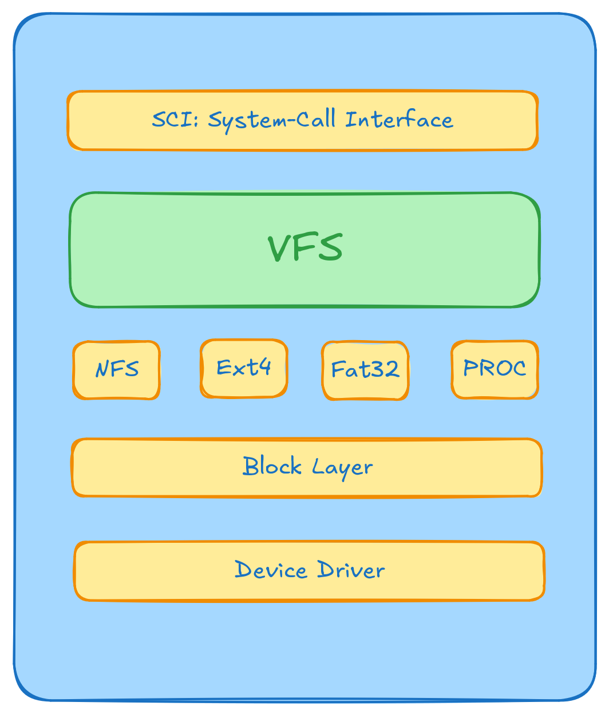

# Linux文件系统与Ext4原理

### 参考/摘抄来源：

+ [2024年6月份比赛的学长的实现参考——Ext4文件系统实现探索：与FAT32的比较分析](https://github.com/Baozixu99/NPUcoreLA/blob/main/docs/Ext4%E6%96%87%E4%BB%B6%E7%B3%BB%E7%BB%9F%E5%AE%9E%E7%8E%B0%E6%8E%A2%E7%B4%A2%EF%BC%9A%E4%B8%8EFAT32%E7%9A%84%E6%AF%94%E8%BE%83%E5%88%86%E6%9E%90.md)
+ Linux命令行与shell脚本编程大全（第4版）
+ [操作系统学习笔记（六）文件系统](https://www.cnblogs.com/lustar/p/7912714.html)
+ 现代操作系统（第4版）安德鲁 S 塔嫩鲍姆，赫伯特 博斯
+ [Linux 虚拟文件系统四大对象：超级块、inode、dentry、file之间关系](https://www.cnblogs.com/yikoulinux/p/14470713.html)
+ Linux内核设计与实现 （第3版） Robert Love

## 〇、写在之前

### 0.1 一些写在文件系统之前的基本知识

在操作系统启动的时候，通过读取**MBR**或者**GPT**中的信息来获取磁盘上的分区信息（以及其他的信息），而不同的文件系统对应着不同的魔数（就是特别的用来与其他魔数相区分的数字），~~在读取**MBR**或**GPT**的时候就可以获取到各个分区的魔数信息，~~也有可能先通过Grub先读取部分信息，然后再通过`/etc/fstab`来获取要挂载的分区的信息，而识别不同文件系统就是靠读取文件系统分区引导块上的魔数信息完成，这个时候就可以知晓磁盘上的文件系统都是些什么。

在计算机启动的时候，如果磁盘是**MBR**分区，那么就需要主板支持**BIOS**（有时候也称**Legacy**）启动；如果是**GPT**分区，就需要支持**UEFI**启动

#### BIOS

即 **Basic Input-Output System** 基本输入输出系统

#### UEFI

#### MBR

即 **Master Boot Record** 主引导记录

MBR分区大小为512B，以0x55aa结尾。（**Fat32的引导块第512个字节也是0x55aa**）

512B 包括： **440**代码区 + **4**选用磁盘标志 + **2**空值(0x00) + **64**标准MBR分区表规划 + **2**MBR有效标志(0x55aa)

MBR是比较老的方式，最多支持4个主分区，或者3个主分区+1个扩展分区，扩展分区可以包含多个逻辑分区

MBR使用4个字节32位来记录每个分区的总大小，单位是块，也就是说一个分区最多有2^32 个块，若每个块大小为512KB,那么一个分区最多就只有2TB的大小。

#### GPT

即 **Globally Unique Identifier Partition Table** 全局唯一标识分区表，

也可以简写为 **GUID Partition Table**，是与UEFI相关的新磁盘布局。

GPT可以支持最多128个分区，并且分区可以识别的大小更大。

### 0.2 ext 文件系统

#### 0.2.0 写在之前

**索引节点** 与 **Inode** 是同一个东西

**索引节点表** 与 **Inode Table** 是同一个东西

**扩展文件系统** 与 **extended filesystem**（**ext**） 是一个东西

#### 0.2.1 ext发展历史

##### 0.2.1.1 ext文件系统

即 **extended filesystem**，扩展文件系统，是Linux最早引入的文件系统。使用虚拟目录来操作硬件设备，在物理设备上按定长的块来存储数据。

ext文件系统采用**inode**（即索引节点）来存放虚拟目录中所存储文件的信息，索引节点系统在每个物理设备中创建一个单独的表（Inode表）来存储这些文件的信息。存储在虚拟目录中的每一个文件在Inode表中都有对应的一个inode项

**extended**来自于跟踪文件产生的额外数据，最早的时候包括：

+ 文件名
+ 文件大小
+ 文件的所有者
+ 文件的所有者所在的组
+ 文件的访问权限
+ 指向存有文件数据的每个硬盘块的指针

通过Inode number，Linux就可以引用索引节点表的每个索引节点。文件系统通过索引节点号而不是文件名和路径来标识文件。

ext文件系统大小不可以超过2GB。

##### 0.2.1.2 ext2 文件系统

Linux出现以后对ext进行了升级，保持与ext相同的文件系统结构的同时，ext2在功能上做了拓展：

+ 在inode表中加入了文件的创建时间、修改时间以及最后一次访问时间

  即create_time、modify_time、access_time

+ 允许的最大文件大小增加到2TB，后期增加到32TB
+ 保存文件时按组分配磁盘块

但是问题出现了，当系统在存储文件和更新inode table之间出现了不好的事情的时候，可能就会丢失文件在磁盘上的数据位置。比方说在将文件写入磁盘时，没有更新inode table就直接断电了，那么就寄了——文件写入了磁盘，但是在文件系统中找不到这个文件的存在。

所以日志文件系统应运而生。

##### 0.2.1.3 ext3 文件系统

ext3并不是最早的日志文件系统，但是因为这一节是要介绍ext文件系统的，所以写在这里了。

###### 日志文件系统

ext2是先将数据直接写入存储设备，再更新**索引节点表**。

**日志文件系统**改变了这一操作：先将文件的变更写入临时文件，称作**日志**，也即 **Journal**，数据被成功写入到存储设备和**索引节点表**之后，再删除对应的日志条目。

如果数据写完之前，系统崩溃了或者断电了，那么日志文件系统就可以通过读取日志文件，处理还没有提交的数据。

| 方法     | 描述                                                         |
| -------- | ------------------------------------------------------------ |
| 数据模式 | inode和文件数据都会被写入日志；数据丢失风险低，但性能差      |
| 有序模式 | 只有inode数据会被写入日志，直到文件数据被成功写入后才会将其删除；在性能和安全性之间取得了良好的折中 |
| 回写模式 | 只有inode数据会被写入日志，但不控制文件何时写入；数据丢失风险高，但仍好于不用日志 |

可以看得出来，数据模式最安全，但是最慢。所有写入存储设备的数据都要写两次：第一次写入日志，第二次写入实际的存储设备。这样会导致性能低下

###### ⚠️TODO！

## 一、Linux（类Unix）下的文件系统

Linux下有多种文件系统可以使用

+ Ext4
+ ZFS
+ XFS
+ Btrfs
+ f2fs
+ FAT32
+ exFAT
+ NTFS
+ ...

现在我们假设有一个已经分配好了的磁盘，磁盘的第一个分区是MBR分区，其中记录了这个磁盘上各个分区的相关信息，然后在这个MBR分区之后的第一个分区，被我们格式化成了Ext4分区，所以在这个分区中，磁盘被分成了多个块组。其中每个块组包含：

+ 第0个块——Superblock（超级块）：存储了整个文件系统的元信息，并且会在每一个块组的首部都复制一份
+ 

在类Unix的文件系统中，每个文件都必须对应一个inode。

磁盘中有多少（或者说分区中）文件，就需要有多少inode

文件以索引结构来组织，也就是说，一个文件内部被拆成多份不连续的存在（称之为块），分散到不连续的零散的空间中。Unix文件系统为每个文件的所有块建立了一个索引表，也就是一个块地址数组。每个数组元素就是块的地址。

比方说，有一个文件A，包含有三个块，那么他的块地址数组就会存储三个元素，分别是这三个块所在的块地址。

### 1.1 Fat32

#### 1.1.1 设计原理

FAT32文件系统使用 **File Allocation Table** （文件分配表）来管理文件和目录。它使用链式分配，每个文件和目录由簇链连接。

 一个文件分配多个**簇**，即 **Cluster**。

因为要对块进行索引，所以将多个块合并为一个簇，这样标记簇号的索引需求就少很多。

**FAT是簇序号的数组**，表示下一个簇。（文件由簇的链表形式组织）原因：省空间。

若是中间有个簇出问题了，那么链表就断了，所以FAT有两个FAT表。第二个用于第一个表出问题的时候。

FAT32 的32指用32位也即4个字节来标记每一个簇的索引。

簇：一般为8个块，每个块一般为512字节，一个簇4096字节

所以最多可以有2^32次方个簇，每个簇4096字节也就是说：

分区最大空间=2^32*2^12 = 2^44 = 16TB

ZFS这种逆天文件系统使用128位来代表索引

+ 2^10 = 1K
+ 2^20 = 1M
+ 2^30 = 1G
+ 2^40 = 1T

#### 1.1.2 结构和组件

FAT头、FAT分配表、FAT数据区

FAT头记录文件系统的整体信息，比较关键的有如下几个：

+ 文件系统总块数
+ 每个簇的块数
+ FAT保留块数
+ 分区前已使用块数
+ FAT表个数
+ FAT表大小
+ 根目录簇号等

FAT表一般有两张，FAT1使用，FAT2做备份

FAT数据区也就是实际保存文件的地方。分为根目录和其子项，根目录一般位于开头

FAT表每个项存放的是下一个簇所在的位置，由32位即4字节表示。

当访问一个文件的时候，会先访问数据区中的该文件第一个簇所在的位置，然后再在FAT表得到下一个簇的位置。然后继续访问数据区中对应的数据簇，直到得到的下一次的数据簇的位置为FFFF（即32位全为1的时候），代表文件访问结束。

+ Boot Sector：包含文件系统类型和相关信息
+ FAT：用于记录每个簇的状态
+ Root Directory：存储文件和目录的元数据
+ Data Area：存储实际数据

#### 1.1.3 优势和限制

+ 优势：简单易实现，兼容性强
+ 限制：不支持大文件，元数据支持有限，性能和扩展性较差

### 1.2 Ext4

#### 1.2.1 设计原理

是Ext3文件系统的改进版，采用多种技术提高性能和可靠性，如延迟分配、扩展、日志记录等。

#### 1.2.2 结构和组件

+ Superblock：存储文件系统信息，在每一个块组里面都有备份
+ Inode Table：存储文件和目录的元数据
+ Block Group：块组，每个块组包含数据块、inode表以及超级块的备份。
+ Journaling：用于记录文件系统的变化，以便在系统崩溃时恢复

#### 1.2.3 优势和限制

+ 优势：支持大文件和大容量存储，元数据丰富，性能和可靠性高
+ 限制：实现复杂度高，设计和实现要求较高

### 1.3 对比

| 文件系统类型   | Ext4                                                         | Fat32                                |
| -------------- | ------------------------------------------------------------ | ------------------------------------ |
| 文件分配和管理 | 使用inode和扩展，效率高，支持大文件和动态分配                | 使用链式分配，简单但效率低           |
| 元数据处理     | 支持丰富的元数据，如权限、所有者、时间戳等，并采用日志记录保证数据一致性 | 元数据支持有限、仅包含基本信息       |
| 性能和可扩展性 | 用于大容量存储，具有更好的性能和可扩展性                     | 适用于中小型存储，性能和可扩展性较差 |
| 错误处理和恢复 | 通过日志记录和**校验和**机制来提供可靠的错误处理和恢复功能   | 基本的错误处理，缺乏高级恢复机制     |

### 1.4 Ext4 设计与实现

#### 1.4.1 Ext4核心组件

+ 超级块：存储文件系统信息
+ 块组：包含多个信息：
  + 块组描述符：描述块组的结构和内容
  + 块位图：
  + Inode位图：
  + Inode表：
  + 数据块：存储实际数据

#### 1.4.2 日志机制

日志机制记录文件系统的变化，确保在系统崩溃后能够恢复。Ext4的日志记录支持三种模式：数据模式、元数据模式和订单模式，提供不同级别的数据保护。

#### 1.4.3 扩展和动态分配

采用扩展（**Extent**）技术来提高文件分配效率。扩展是连续数据块的集合，可以减少文件分配的碎片化，提高文件系统的性能。

#### 1.4.4 目录结构和索引

使用**HTree** 索引来管理目录，提高目录查找和操作的效率。HTree是一种B+树结构，能够快速定位目录项

---

## 二、虚拟文件系统 VFS

### 2.1 Linux 虚拟文件系统

> 虚拟文件系统隐藏了Linux支持的文件系统之间的区别。本地或网络，类型差异等。

#### 2.1.1 VFS在Linux内核中的位置

如图所示，VFS在Linux内核中大概位于那么一个位置，用户态下应用（通常是IO操作）通过用户态调用进入到内核态，再通过内核态的文件系统相关的系统调用去调用VFS的各个方法，通过VFS，内核可以对不同类型的文件系统进行操作。

如果没有VFS，用户对不同的文件系统执行同一个操作则需要复杂的、不同的操作。有了VFS之后，这些具体细节对于用户来说都是透明的——因为只需要跟VFS打交道，打开文件，告诉VFS去open一个文件就可以了，写一个文件，告诉VFS去write一个就可以了……

VFS是一种软机制，只存在于内存中。什么意思呢，每次系统初始化期间Linux都会先在内存中构造一棵VFS目录树（在NPUcore中也就是`DirectryTreeNode`构成的树）

所有和文件相关的系统调用在最初的处理上都指向虚拟文件系统，这些来自用户进程的调用，都是标准的POSIX系统调用，比如open、read、write和lseek等。因此，VFS对用户进程有一个“上层”接口，即著名的POSIX接口。这个抽象层将POSIX API接口与不同存储设备的具体接口进行了分离，使得底层的文件系统类型、设备类型对上层应用程序透明。

#### 2.1.2 VFS 四大数据结构(Linux下)

> 虽然Linux的VFS是用c语言编写的，但是其本身采用的是面向对象的设计思路：使用一组数据结构来表示通用文件对象。这些类似于对象，然后附带有对应的函数（面向对象编程中称之为方法）。

在磁盘上，文件（包括目录）信息按照**Inode**形式存储在单独的块中；控制信息被集中存储在**超级块Superblock**中，等等。Linux（或者说类Unix）的VFS的设计目标就是保证能与支持和实现了包括**文件**、**目录项**、**索引节点**、**挂载点（Mount Point）**等概念的文件系统协同工作。比方说**Fat**或者**NTFS**这样的非Unix风格的文件系统，虽然也可以在Linux上工作，但是它们必须经过封装，提供一个符合这些概念的接口。例如，即使一个文件系统不支持Inode，它也必须在内存中装配Inode结构体（NPUcore中也是那么做的，对于Fat32文件系统，就存在一个Inode结构体），就好像它本身就包含Inode一样。再比如，如果一个文件系统将目录看作是一种特殊对象，那么要想通过VFS使用它，就必须将目录重新封装为文件（普通文件）形式（但是通常这种做法开销会特别大）。

VFS定义了一个基本的文件系统抽象以及这些抽象上允许的操作，有四个主要结构（对象）：

+ **Superblock** 超级块对象：记录文件系统布局的重要信息
+ **Inode** 索引节点对象：每个Inode代表一个确切的文件，目录和设备也是文件，也有自己的Inode
+ **Dentry** 目录项对象：文件系统在运行过程中创建，目录项被缓存在内存中。
+ **File** 文件对象：打开文件在内存中表示的数据结构，在调用open时被创建。支持read/write/close/lseek等系统调用

因为一切皆文件，目录也是，所以不存在目录对象，此处的目录对象与目录项对象不同，前者（若存在）指的是物理磁盘上真实存在的目录逻辑结构，后者指的是读取磁盘后，内核在内存中缓存的路径的组成部分。

每个主要对象中都包含一个操作对象，这些操作对象描述了内核针对主要对象可以使用的方法：

+ super_operations 对象 包括内核针对**特定文件系统**所能调用的方法，如write_inode、sync_fs等
+ inode_operations 对象 包括内核针对**特定文件**所能调用的方法，如create、link等
+ dentry_operations 对象 包括内核针对**特定目录**所能调用的方法，如d_compare、d_delete等
+ file_operations 对象 包括进程针对**已打开文件**所能调用的方法，如read、write等
