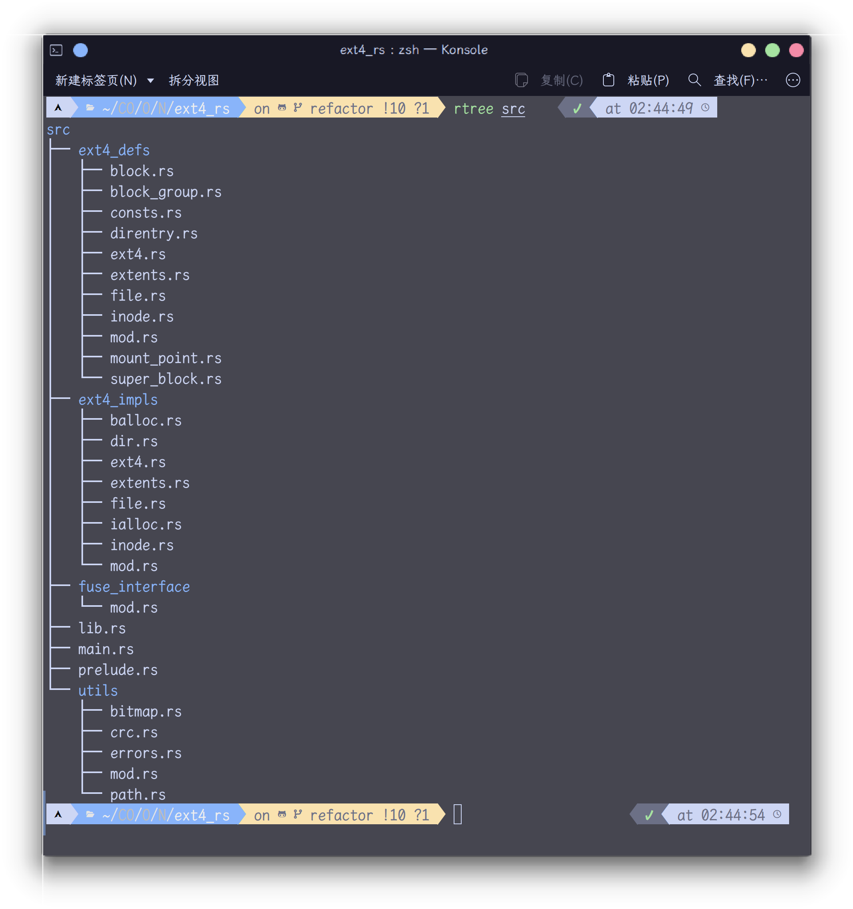

# 实践笔记

## 一、概要

任务是给NPUcore-LA做增量，添加对**ext4**的支持

前置的笔记内容（如NPUcore-LA `fs`模块代码的阅读注解）见另外几篇文档

在经历了一段时间的阅读代码加修改后，代码部分结构变成了如下（后面可能还会大改）：

```bash
rtree os/src/fs
os/src/fs
├── cache.rs
├── dev
│   ├── hwclock.rs
│   ├── mod.rs
│   ├── null.rs
│   ├── pipe.rs
│   ├── socket.rs
│   ├── tty.rs
│   └── zero.rs
├── directory_tree.rs
├── dirent.rs
├── ext4
│   ├── bitmap.rs
│   ├── block.rs
│   ├── block_group.rs
│   ├── dir_iter.rs
│   ├── efs.rs
│   ├── ext4_inode.rs
│   ├── file.rs
│   ├── layout.rs
│   ├── mod.rs
│   └── superblock.rs
├── fat32
│   ├── bitmap.rs
│   ├── dir_iter.rs
│   ├── efs.rs
│   ├── fat_inode.rs
│   ├── file.rs
│   ├── layout.rs
│   └── mod.rs
├── file_descriptor.rs
├── file_trait.rs
├── filesystem.rs
├── inode.rs
├── layout.rs
├── mod.rs
├── poll.rs
├── swap.rs
└── vfs.rs
```

`src/fs/ext4`部分内容并未实现，只是创建了文件，当作代码框架

`src/fs/dev`内容暂时不用管

`src/fs/fat32`是`fat32`的具体实现，内部的`vfs`需要包装，`OSInode`实际上是和`fat32`模块中`Inode`绑死的东西，或许需要另外实现。（考虑利用Rust的`dyn`特性）

```bash
rtree os/src/fs --fileonly
os/src/fs
├── cache.rs
├── directory_tree.rs
├── dirent.rs
├── file_descriptor.rs
├── file_trait.rs
├── filesystem.rs
├── inode.rs
├── layout.rs
├── mod.rs
├── poll.rs
├── swap.rs
└── vfs.rs
```

+ `cache.rs` 是要接触的重要内容之一

+ `directory_tree.rs` 目录树，用于获取文件系统的目录树结构，**或许可以利用来辅助完成VFS**

+ `dirent.rs` Linux原生Dirent结构

+ `file_descriptor.rs` 文件描述符，实际上在NPUcore中为其实现了许多文件的操作（然而似乎都是调用`DirectoryTreeNode` 的方法），**或许可以利用来辅助完成VFS**

+ `file_trait.rs` 文件特征，即 `File trait`，实现了这个`trait`的类型可以被`fs`下的其他数据结构使用，`syscall`调用中与`fs`相关的的都可以追溯到这里，**或许可以利用来辅助完成VFS**
  
  + `file_trait`中是围绕`DirectoryTreeNode`来做的，也就是说，只要实现了`File trait`，那么必然可以使用`DirectoryTreeNode`的所有内容。
  
  + 但实际上`DirectoryTreeNode`继续往内部调用了**OSInode**，**或许真正要解耦的是这个玩意**。
  
  + 2024/12/11 记： 但是又重新过来看了一下`DirectoryTreeNode`的代码，发现`DirectoryTreeNode`内部实际上已经完成了类似解耦的工作，DirectoryTreeNode内部结构如下：
  
    + ```rust
      pub struct DirectoryTreeNode {
          /// If this is a directory
          /// 1. cwd 当前工作目录
          /// 2. mount point 挂载点
          /// 3. root node 根节点
          /// 如果这是个文件
          /// 1. executed by some processes 被某些进程执行
          /// This parameter will add 1 when opening 该参数在打开时增加1
          spe_usage: Mutex<usize>,
          name: String,
          filesystem: Arc<FileSystem>,
          file: Arc<dyn File>,
          selfptr: Mutex<Weak<Self>>,
          father: Mutex<Weak<Self>>,
          children: RwLock<Option<BTreeMap<String, Arc<Self>>>>,
      }
      ```
  
+ `filesystem.rs` 文件系统，包含 `FS_Type` 、`FileSystem` 、静态引用 `FS_ID_COUNTER`

+ `inode.rs` 系统 Inode，包含~~脱裤子放屁的~~（一定有它的道理！）`InodeTime`，文件或者目录类型`DiskInodeType`（应该有更优雅的方法实现）

+ `layout.rs` 包含`OpenFlags`、`SeekWhence`、`StatMode` 三种标志位集以及文件属性 `Stat`

+ `mod.rs` 包含根目录的文件描述符 `ROOT_FD`

+ `poll.rs` （poll是一个在指定文件描述符上监听发生的任何文件事件的系统调用）包含`PollEvent`标志位集，`PollFd` 结构、`FdSet` 结构

+ `swap.rs` 交换空间

+ `vfs.rs` 打算实现的 `VFS trait`

## 二、实践

### 2.1 VFS层解耦（不是特别严谨）

#### 2.1.1 可行的尝试——或许可能有用的InodeTrait

~~或许应该制作一张**什么是VFS**的九宫格梗图然后摆在这里~~

首先看看`main.rs`的内容，毕竟内核逻辑上是从这里开始的

`os/src/main.rs`

```rust
#[no_mangle]
pub fn rust_main() -> ! {
    bootstrap_init();
    mem_clear();
    console::log_init();
    println!("[kernel] Console initialized.");
    mm::init();
    // note that remap_test is currently NOT supported by LA64, for the whole kernel space is RW!
    //mm::remap_test();

    machine_init();
    println!("[kernel] Hello, world!");
    println!("[test] Point1");

    //machine independent initialization
    fs::directory_tree::init_fs();
    task::add_initproc();

    // note that in run_tasks(), there is yet *another* pre_start_init(),
    // which is used to turn on interrupts in some archs like LoongArch.
    task::run_tasks();
    panic!("Unreachable in rust_main!");
}
```

可以看到文件系统初始化的那一行

```rust
fs::directory_tree::init_fs();
```

`os/src/fs/directory_tree.rs`

```rust
pub fn init_fs() {
    init_device_directory();
    init_tmp_directory();
    init_proc_directory();
}
```

后两行函数分别是初始化`/tmp`目录和 `/proc`目录，这里不需要关注

`os/src/fs/directory_tree.rs`

```rust
#[allow(unused)]
// 初始化设备目录
fn init_device_directory() {
    ROOT.mkdir("/dev");

    let dev_inode = match ROOT.cd_path("/dev") {
        Ok(inode) => inode,
        Err(_) => panic!("dev directory doesn't exist"),
    };

    dev_inode.mkdir("shm");
    dev_inode.mkdir("misc");

    let null_dev = DirectoryTreeNode::new(
        "null".to_string(),
        Arc::new(FileSystem::new(FS_Type::Null)),
        Arc::new(Null {}),
        Arc::downgrade(&dev_inode.get_arc()),
    );
    let zero_dev = DirectoryTreeNode::new(
        "zero".to_string(),
        Arc::new(FileSystem::new(FS_Type::Null)),
        Arc::new(Zero {}),
        Arc::downgrade(&dev_inode.get_arc()),
    );
    let tty_dev = DirectoryTreeNode::new(
        "tty".to_string(),
        Arc::new(FileSystem::new(FS_Type::Null)),
        Arc::new(Teletype::new()),
        Arc::downgrade(&dev_inode.get_arc()),
    );
    let mut lock = dev_inode.children.write();
    lock.as_mut().unwrap().insert("null".to_string(), null_dev);
    lock.as_mut().unwrap().insert("zero".to_string(), zero_dev);
    lock.as_mut().unwrap().insert("tty".to_string(), tty_dev);
    drop(lock);

    let misc_inode = match dev_inode.cd_path("./misc") {
        Ok(inode) => inode,
        Err(_) => panic!("misc directory doesn't exist"),
    };
    let hwclock_dev = DirectoryTreeNode::new(
        "rtc".to_string(),
        Arc::new(FileSystem::new(FS_Type::Null)),
        Arc::new(Hwclock {}),
        Arc::downgrade(&misc_inode.get_arc()),
    );
    let mut lock = misc_inode.children.write();
    misc_inode.cache_all_subfile(&mut lock);
    lock.as_mut()
        .unwrap()
        .insert("rtc".to_string(), hwclock_dev);
    drop(lock);
}
```

初始化好像没有我们需要的根目录对吧？

我们需要的根目录在`directory_tree.rs`的`lazy_static!`中定义：

```rust
lazy_static! {
    pub static ref FILE_SYSTEM: Arc<EasyFileSystem> = EasyFileSystem::open(
        BLOCK_DEVICE.clone(),
        Arc::new(Mutex::new(BlockCacheManager::new()))
    );
    // 目录树根节点
    pub static ref ROOT: Arc<DirectoryTreeNode> = {
        let inode = DirectoryTreeNode::new(
            // 因为是根节点，所以没有名字（根目录是不是只有‘/’，斜杠左边是不是啥也没有？）
            "".to_string(),
            // TODO: 后面要添加 ext4 文件系统
            Arc::new(FileSystem::new(CURR_FS_TYPE)),
            OSInode::new(InodeImpl::root_inode(&FILE_SYSTEM)),
            // 父节点，因为是根节点所以没有父节点
            Weak::new(),
        );
        inode.add_special_use();
        inode
    };
    static ref DIRECTORY_VEC: Mutex<(Vec<Weak<DirectoryTreeNode>>, usize)> =
        Mutex::new((Vec::new(), 0));
    static ref PATH_CACHE: Mutex<(String, Weak<DirectoryTreeNode>)> =
        Mutex::new(("".to_string(), Weak::new()));
}
```

发现了还需要~~该死的~~`EasyFileSystem`以及`OSInode`，完完全全绕着`Fat32`写的。

动刀要从这里开始动了。

（在最初写到此处时，还没有意识到`DirectoryTreeNode`其实已经算是“解耦”了）

所幸的是，`DirectoryTreeNode`几乎与`fat32`没有关系，而其`new`函数在这里所需要的`OSInode`也仅仅只是需要实现`File Trait`的数据结构就可替代，也就是说，可以按如下方式实现（不考虑将`EasyFileSystem`作为通用抽象层的方法）：

将此处的`FILE_SYSTEM`中的`EasyFileSystem`想办法包一层包装，通过这层包装来实现不同文件系统的使用。（后续实际是使用了**dyn trait** 动态分发对象）

将`OSInode`这一部分，也套一层包装，或者说想办法将`OSInode`与`fat32`解耦（~~里面的`clus`和`fat`看得让人心惊目眩~~）

（一段时间之后注：在经过这段时间的学习之后，包括**fat32的原理**，这部分内容倒也显得亲切了）

去查看了**rCore-Tutorial-Book-v3**的文件系统章节，发现其为实现文件系统的管理，先实现了一个与NTFS、EXT4、FAT32文件系统同类型概念的EFS（Easy File System），

然后，

**NPUcore-LA 大概是修改了这部分代码，将EFS与FAT32对接。**（**或者说帮Fat32把EFS给夺舍了**）

再来看看`OSInode`内部有什么

```rust
/// OSInode
/// 对具体文件系统Inode的封装
pub struct OSInode {
    readable: bool,
    writable: bool,
    special_use: bool,
    append: bool,
    inner: Arc<InodeImpl>,
    offset: Mutex<usize>,
    dirnode_ptr: Arc<Mutex<Weak<DirectoryTreeNode>>>,
}
```

可以看到里面有且只有一个与具体文件系统相关的东西：`inner`，即`InodeImpl`的智能指针

也就是说，只需要对这个结构进行修改，~~就万事大吉，~~并修改OSInode的方法中与fat32相关的内容（做一步包装，调用不同文件系统的同一方法）

然后在试图对`OSInode`以及`Inode`动手动脚的时候出现了问题：

为了将`OSInode`与`Inode`拆分，将`Inode`内部被`OSInode`调用的函数抽离成一个`InodeTrait`，但是InodeTrait内部会有方法，使用**自身类型Self**作为参数并且还使用**泛型**（这里泛型好像不包括**动态对象**）作为返回值——这与Rust的安全特性相悖（Fxxk it），在折腾了一天之后（12.5开始添加晚上遇到问题，写到这里的时候是12.6），去看了一下`File Trait`的实现，因为`File Trait`内部也有这种场景，但是`File Trait`多了一个`DowncastSync`特性：

```rust
pub trait File: DowncastSync {
    /// ...
    fn deep_clone(&self) -> Arc<dyn File>;
    /// open
    fn open(&self, flags: OpenFlags, special_use: bool) -> Arc<dyn File>;
    fn open_subfile(&self) -> Result<Vec<(String, Arc<dyn File>)>, isize>;
    /// create
    fn create(&self, name: &str, file_type: DiskInodeType) -> Result<Arc<dyn File>, isize>;
    fn link_child(&self, name: &str, child: &Self) -> Result<(), isize>
    where
        Self: Sized;
    /// ...
}
impl_downcast!(sync File);
```

可以看到有五个函数~~疑似犯天条了~~（PS：后面去查了一下好像前四个都没事）

但是为啥还能过编译？我不明白，~~为什么大家都在讨论项羽被困垓下~~

所以又去看`File Trait`的具体实现，以`OSInode`为例

```rust
impl File for OSInode {
    fn deep_clone(&self) -> Arc<dyn File> {
        if self.special_use {
            let inode = self.get_dirtree_node();
            match inode {
                Some(inode) => inode.add_special_use(),
                None => {}
            }
        }
        Arc::new(Self {
            readable: self.readable,
            writable: self.writable,
            special_use: self.special_use,
            append: self.append,
            inner: self.inner.clone(),
            offset: Mutex::new(*self.offset.lock()),
            dirnode_ptr: self.dirnode_ptr.clone(),
        })
    }
    fn open(&self, flags: OpenFlags, special_use: bool) -> Arc<dyn File> {
        Arc::new(Self {
            readable: flags.contains(OpenFlags::O_RDONLY) || flags.contains(OpenFlags::O_RDWR),
            writable: flags.contains(OpenFlags::O_WRONLY) || flags.contains(OpenFlags::O_RDWR),
            special_use,
            append: flags.contains(OpenFlags::O_APPEND),
            inner: self.inner.clone(),
            offset: Mutex::new(0),
            dirnode_ptr: self.dirnode_ptr.clone(),
        })
    }
    fn open_subfile(&self) -> Result<Vec<(String, Arc<dyn File>)>, isize> {
        let inode_lock = self.inner.write();
        let get_dyn_file = |short_ent, offset| -> Arc<dyn File> {
            Arc::new(Self {
                readable: true,
                writable: true,
                special_use: false,
                append: false,
                inner: Inode::from_ent(&self.inner, short_ent, offset),
                offset: Mutex::new(0),
                dirnode_ptr: Arc::new(Mutex::new(Weak::new())),
            })
        };
        Ok(self
            .inner
            .get_all_files_lock(&inode_lock)
            .iter()
            .map(|(name, short_ent, offset)| (name.clone(), get_dyn_file(short_ent, *offset)))
            .collect())
    }
    fn create(&self, name: &str, file_type: DiskInodeType) -> Result<Arc<dyn File>, isize> {
        let inode_lock = self.inner.write();
        let new_file = Inode::create_lock(&self.inner, &inode_lock, name.to_string(), file_type);
        if let Ok(inner) = new_file {
            Ok(Arc::new(Self {
                readable: true,
                writable: true,
                special_use: false,
                append: false,
                inner,
                offset: Mutex::new(0),
                dirnode_ptr: Arc::new(Mutex::new(Weak::new())),
            }))
        } else {
            panic!()
        }
    }
    fn link_child(&self, name: &str, child: &Self) -> Result<(), isize>
    where
        Self: Sized,
    {
        let par_inode_lock = self.inner.write();
        let child_inode_lock = child.inner.write();
        if child
            .inner
            .link_par_lock(
                &child_inode_lock,
                &self.inner,
                &par_inode_lock,
                name.to_string(),
            )
            .is_err()
        {
            panic!();
        }
        Ok(())
    }
}
```

为什么呢？好像这里面这个`link_child`使用了`Self: Sized`

那么为所有的使用了`Self`作为参数的方法全部加上这玩意，没报错，但是新的问题又来了：

关联函数怎么处理？因为关联函数返回的是具体类型，而调用的时候又不是使用一个具体实例而是直接用抽象类型中的关联函数（~~怎么说能说的像人话一点~~），也就是说，返回的类型是具体类型而不是我们想要的`InodeTrait`，要如何解决？

这里我先将这些关联函数改成方法，但是又有问题了：

在具体的类型里面，会实现的是这样子的：

```rust
    fn from_ent(&self, parent_dir: &Arc<dyn InodeTrait>, ent: &FATShortDirEnt, offset: u32) -> Arc<dyn InodeTrait>类型转换为父trait
    where
        Self: Sized,
    {
        let inode = Self::from_fat_ent(parent_dir, ent, offset);
        inode
    }
```

这下编译器有话要说了：

```bash
mismatched types
expected reference `&Arc<Inode>`
   found reference `&Arc<(dyn InodeTrait + 'static)>`
`Inode` implements `InodeTrait` so you could change the expected type to `Box<dyn InodeTrait>`
```

但是这个Box我之前试过（不是很深入的试）没有搞成，先不考虑，~~总不能拿Box套Arc~~

那要如何解决？

回忆一下是不是前面有个特性还是`unused`，

没错就是`DowncastSync`

[downcast使用方法](https://bennett.dev/rust/downcast-trait-object/#:~:text=Downcasting%20is%20Rust%27s%20method%20of%20converting%20a%20trait,of%20any%20%27static%20type%20through%20runtime%20reflection%22%20%28docs%29.)

结果按着来之后编译还是会出问题，最终，在`2024.12.7`的`19:00`左右，通过argue gpt，使用了一个**实验性功能**：

`#![feature(trait_upcasting)]`（添加在`main.rs`头部）

然后在`from_ent`函数（`Inode`内的实现）内部，改为如下代码：

```rust
fn from_ent(&self, parent_dir: &Arc<dyn InodeTrait>, ent: &FATShortDirEnt, offset: u32) -> Arc<dyn InodeTrait>
{
    let parent_dir_specific = Arc::downcast::<Inode>(parent_dir.clone()).unwrap();
    let inode = Self::from_fat_ent(&parent_dir_specific, ent, offset);
    inode
}
```

也就是说，将`parent_dir.clone()`获取后，使用`Arc`内部的`downcast`将其下转为具体类型`Inode`类型，然后就可以通过将这个项传给`Inode`类型的关联函数`from_fat_ent`来获取`inode`

若不启用上面那个功能，编译器就会报错：

```bash
cannot cast `dyn InodeTrait` to `dyn Any + Send + Sync`, trait upcasting coercion is experimental
see issue #65991 <https://github.com/rust-lang/rust/issues/65991> for more information
add `#![feature(trait_upcasting)]` to the crate attributes to enable
this compiler was built on 2024-04-30; consider upgrading it if it is out of date
required when coercing `Arc<dyn InodeTrait>` into `Arc<(dyn Any + Send + Sync + 'static), _>`
```

这个功能其实是隐性特质上升。将**子trait转为父trait**或者将**类型转换为父trait**。

这里后面需要去深入了解一下并作一下相关的笔记，先添加一个TODO：在这里：

###### ⚠️TODO：

然后完成了上面那一步之后，再去对另外两个函数也进行修改，也就是说共计三个“疑难杂症”函数：

```rust
fn from_ent(&self, parent_dir: &Arc<dyn InodeTrait>, ent: &FATShortDirEnt, offset: u32) -> Arc<dyn InodeTrait>;
fn link_par_lock(
    &self,
    inode_lock: &RwLockWriteGuard<InodeLock>,
    parent_dir: &Arc<dyn InodeTrait>,
    parent_inode_lock: &RwLockWriteGuard<InodeLock>,
    name: String,
) -> Result<(), ()>;
fn create_lock(
    &self,
    parent_dir: &Arc<dyn InodeTrait>,
    parent_inode_lock: &RwLockWriteGuard<InodeLock>,
    name: String,
    file_type: DiskInodeType,
) -> Result<Arc<dyn InodeTrait>, ()>;
```

具体实现为：

```rust
    fn from_ent(&self, parent_dir: &Arc<dyn InodeTrait>, ent: &FATShortDirEnt, offset: u32) -> Arc<dyn InodeTrait>
    {
        let parent_dir_specific = Arc::downcast::<Inode>(parent_dir.clone()).unwrap();
        let inode = Self::from_fat_ent(&parent_dir_specific, ent, offset);
        inode
    }

    fn link_par_lock(
        &self,
        inode_lock: &RwLockWriteGuard<InodeLock>,
        parent_dir: &Arc<dyn InodeTrait>,
        parent_inode_lock: &RwLockWriteGuard<InodeLock>,
        name: String,
    ) -> Result<(), ()>
    {
        let parent_dir_specific = Arc::downcast::<Inode>(parent_dir.clone()).unwrap();
        // Generate directory entries
        let (short_ent, long_ents) = Self::gen_dir_ent(
            &parent_dir_specific,
            parent_inode_lock,
            &name,
            self.get_first_clus_lock(&self.file_content.read())
                .unwrap_or(0),
            *self.file_type.lock(),
        );
        // Allocate new directory entry
        let short_ent_offset =
            match parent_dir_specific.create_dir_ent(parent_inode_lock, short_ent, long_ents) {
                Ok(offset) => offset,
                Err(_) => return Err(()),
            };
        // If this is a directory, modify ".."
        if self.is_dir()
            && self
                .modify_parent_dir_entry(
                    inode_lock,
                    parent_dir_specific
                    .get_first_clus_lock(&parent_dir_specific.file_content.read())
                    .unwrap(),
                )
                .is_err()
        {
            return Err(());
        }
        // Modify parent directory
        *self.parent_dir.lock() = Some((parent_dir_specific.clone(), short_ent_offset));
        Ok(())
    }
    fn create_lock(
        &self,
        parent_dir: &Arc<dyn InodeTrait>,
        parent_inode_lock: &RwLockWriteGuard<InodeLock>,
        name: String,
        file_type: DiskInodeType,
    ) -> Result<Arc<dyn InodeTrait>, ()>
    {
        let parent_dir_specific = Arc::downcast::<Inode>(parent_dir.clone()).unwrap();
        if parent_dir.is_file() || name.len() >= 256 {
            Err(())
        } else {
            log::debug!(
                "[create] par_inode: {:?}, name: {:?}, file_type: {:?}",
parent_dir_specific.get_inode_num_lock(&parent_dir_specific.file_content.read()),
                &name,
                file_type
            );
            // If file_type is Directory, alloc first cluster
            let fst_clus = if file_type == DiskInodeType::Directory {
                let fst_clus = parent_dir_specific
                    .fs
                    .fat
                    .alloc(&parent_dir_specific.fs.block_device, 1, None);
                if fst_clus.is_empty() {
                    return Err(());
                }
                fst_clus[0]
            } else {
                0
            };
            // Generate directory entries
            let (short_ent, long_ents) =
                Self::gen_dir_ent(&parent_dir_specific, parent_inode_lock, &name, fst_clus, file_type);
            // Create directory entry
            let short_ent_offset =
                match parent_dir_specific.create_dir_ent(parent_inode_lock, short_ent, long_ents) {
                    Ok(offset) => offset,
                    Err(_) => return Err(()),
                };
            // Generate current file
            let current_file = Self::from_fat_ent(&parent_dir_specific, &short_ent, short_ent_offset);
            // If file_type is Directory, set first 3 directory entry
            if file_type == DiskInodeType::Directory {
                // Set hint
                current_file.file_content.write().hint =
                    2 * core::mem::size_of::<FATDirEnt>() as u32;
                // Fill content
                Self::fill_empty_dir(&parent_dir_specific, &current_file, fst_clus);
            }
            Ok(current_file)
        }
    }
```

然后就可以编译通过进入qemu并执行测试了

然后现在还需要对用到`FATDirEnt`的函数以及`directory_tree.rs`下的内容进行更改

先尝试更改后者。

其中`directory_tree.rs`需要动刀的内容如下：

```rust
lazy_static! {
    pub static ref FILE_SYSTEM: Arc<EasyFileSystem> = EasyFileSystem::open(
        BLOCK_DEVICE.clone(),
        Arc::new(Mutex::new(BlockCacheManager::new()))
    );
    // 目录树根节点
    pub static ref ROOT: Arc<DirectoryTreeNode> = {
        let inode = DirectoryTreeNode::new(
            // 因为是根节点，所以没有名字（根目录是不是只有‘/’，斜杠左边是不是啥也没有？）
            "".to_string(),
            // TODO: 后面要添加 ext4 文件系统
            Arc::new(FileSystem::new(CURR_FS_TYPE)),
            // 系统Inode，包装了具体文件系统的Inode
            OSInode::new(InodeImpl::root_inode(&FILE_SYSTEM)),
            // 父节点，因为是根节点所以没有父节点
            Weak::new(),
        );
        inode.add_special_use();
        inode
    };
    static ref DIRECTORY_VEC: Mutex<(Vec<Weak<DirectoryTreeNode>>, usize)> =
        Mutex::new((Vec::new(), 0));
    static ref PATH_CACHE: Mutex<(String, Weak<DirectoryTreeNode>)> =
        Mutex::new(("".to_string(), Weak::new()));
}
```

可以看到被`lazy_static!`包裹，也就是说还不大好动。

第一思路就是：

将内部的`EasyFileSystem`抽象出**必要函数**当作`VFS trait`，即`Virtual File System`，

粗略看了一下应该只有`open`方法。

---

#### 2.1.1.5 插曲——前人的经验（我是否做错了？）

在上面这段笔记过了三四天之后，也就是2024.12.11，在重新阅读了NPUcore-IMPACT!!!的第一阶段文档之后，发现其最终实现是通过`lwext4`实现的（我打算用`ext4_rs`），然后他们的文档中提到针对`ROOT`和`FILESYSTEM`的修改 ，也就是我现在还没完成的（也就是上面要做的），他们直接对这部分代码进行修改，可能是为了尽快完成比赛测例（并存在一些bug）。内容大致如下：

+ FILE_SYSTEM的修改

```rust
pub type EasyFileSystem = lwext4_rs::FileSystem <crate::arch::BlockDeviceImpl >;
type DiskInodeType = lwext4_rs::FileType;
lazy_static! {
	pub static ref FILE_SYSTEM: EasyFileSystem = EasyFileSystem::new(
        MountHandle::mount(
            RegisterHandle::register(BlockDevice::new(BlockDeviceImpl::new()), ”shit”.to_string())
            .unwrap(),
            ”/”.to_string(),
            false,
            false,
        )
        .unwrap()
    )
    .unwrap();
}
```

+ ROOT的修改

```rust
lazy_static! {
    pub static ref ROOT: Arc<DirectoryTreeNode > = {
        FILE_SYSTEM.readdir(”/”).unwrap();
        
        let inode = DirectoryTreeNode::new(
            ””.to_string(),
            Arc::new(FileSystem::new(FS::Fat32)),
            Arc::new(OpenOptions::new().read(true).write(true).open(”/”).unwrap()),
            // OSInode::new(Arc::new()),
            Weak::new(),
        );
        inode.add_special_use();
        inode
    };
    static ref DIRECTORY_VEC: Mutex <(Vec<Weak<DirectoryTreeNode >>,usize)> =
    Mutex::new((Vec::new(), 0));
    static ref PATH_CACHE: Mutex <(String, Weak<DirectoryTreeNode >)> =
    Mutex::new((””.to_string(), Weak::new()));
}
```

可能有点参考意义……

#### 2.1.2 继续——FILE_SYSTEM实现动态类型获取

读完之后自我怀疑（**我前面的InodeTrait是不是等于白做？**）了一段时间之后，又去仔细读了一遍`fat`模块中`efs`模块的代码，其中：

```rust
impl EasyFileSystem {
	/// 打开文件系统对象
    /// # 参数
    /// + `block_device`: 指向硬件设备（存储设备）的指针
    /// + `index_cache_mgr`: fat cache manager
    pub fn open(
        block_device: Arc<dyn BlockDevice>,
        index_cache_mgr: Arc<spin::Mutex<BlockCacheManager>>,
    ) -> Arc<Self> {
        // 为fat_cache_mgr赋值
        let fat_cache_mgr = index_cache_mgr.clone();
        index_cache_mgr
            .lock()
            // 获取第0块的缓存
            .get_block_cache(0, &block_device)
            .lock()
            // 将第0块映射为BPB结构体
            .read(0, |super_block: &BPB| {
                // ***************Do NOT change this LINE!****************
                // 获取超级块（BPB）的每扇区字节数
                let byts_per_sec = super_block.byts_per_sec;
                // 如果每扇区字节数与预想的（la64模块内的设置为2048）不同，则触发panic
                debug_assert!(byts_per_sec as usize == arch::BLOCK_SZ);
                // 如果缓存单位不能被每扇区字节数整除，触发panic
                debug_assert!(BlockCacheManager::CACHE_SZ % byts_per_sec as usize == 0);
                // 如果超级块（BPB）非法，则报错
                debug_assert!(super_block.is_valid(), "Error loading EFS!");
                // 创建efs实例
                let efs = Self {
                    block_device,
                    fat: Fat::new(
                        super_block.rsvd_sec_cnt as usize,
                        byts_per_sec as usize,
                        (super_block.data_sector_count() / super_block.sec_per_clus as u32)
                            as usize,
                        fat_cache_mgr,
                    ),
                    root_clus: super_block.root_clus,
                    sec_per_clus: super_block.sec_per_clus,
                    byts_per_sec,
                    data_area_start_block: super_block.first_data_sector(),
                };
                Arc::new(efs)
            })
    }
}
```

可以看到通过这个`open`函数，调用它的地方就能获取到一个`efs`（实际上是`fat32`）对象

`open`被谁调用？

被下面这个代码块调用：

```rust
// 文件系统实例（或者说姑且把它当作是实例）
pub static ref FILE_SYSTEM: Arc<EasyFileSystem> = EasyFileSystem::open(
    BLOCK_DEVICE.clone(),
    Arc::new(Mutex::new(BlockCacheManager::new()))
);
```

但是这里的代码是不是只能通过`EasyFileSystem`来修改？

所以所以，要对这段代码开刀了。

首先要出场的是**特征** `VFS`

```rust
// VFS trait, 实现了该trait的文件系统都应该可以直接
// 被 NPUcore 支持
pub trait VFS: DowncastSync {
    // 打开文件系统
    fn open(
        &self,
        block_device: Arc<dyn BlockDevice>,
        index_cache_mgr: Arc<spin::Mutex<BlockCacheManager>>,
    ) -> Arc<Self>
    where
        Self: Sized;
    fn get_filesystem_type(&self) -> FS_Type;
}
impl_downcast!(sync VFS);
```

可以看到这里有一个与上面`efs`中一模一样签名的`open`，不过在这里它升级了——变成了方法而不是关联函数，

那么通过这一步就可以将上面的`FILE_SYSTEM`改变一下了，

但是上面代码块中使用的是`EasyFileSystem::open`，这里应该写什么？

写`VFS::open`？但是已经与上面的函数重名了。

所以一开始脑子没转过来，在`filesystem.rs`下给`FS_Type`添加了一个方法（**后面会有说明**这里又做了什么变动）：

```rust
pub fn mount_fs(
    block_device: Arc<dyn BlockDevice>,
    index_cache_mgr: Arc<spin::Mutex<BlockCacheManager>>,
) -> Arc<dyn VFS> {
    let fs_type = pre_mount();
    match fs_type {
        FS_Type::Fat32 => EasyFileSystem::open(block_device, index_cache_mgr),
        FS_Type::Ext4 => Ext4FileSystem::open(block_device, index_cache_mgr),
        FS_Type::Null => panic!("no filesystem found"),
    }
}
```

`pre_mount`是什么呢？

按原先的代码（直接使用`EasyFileSystem::open`的代码），在内核开始初始化文件系统的时候，直接认为读取的文件系统就是`fat32`类型，但是现在我们将这个类型改成**动态获取**的了（也就是说对文件系统识别后才确认文件系统类型），所以我们需要先知道文件系统的类型，才能做出相应的“挂载”操作。

那么如何知道文件系统的类型呢？

按常规PC的方法，是通过读取MBR分区或者GPT表来获取各个分区文件系统类型的。

但是用到的NPUcore-LA仓库，其启动方式是通过`qemu`（预先编译好的，没有找到其编译选项），网络挂载根文件系统镜像和内核镜像，然后用`u-boot`（目前还不是很了解其启动过程具体逻辑）充当`bios`来启动的，然后根文件系统镜像是单分区镜像，不是“硬盘”镜像，所以也就没有MBR分区和GPT分区之说，意思就是不能通过读取MBR分区和GPT表来获取信息了（后面发现实际上操作系统不只是靠这个来识别分区信息，类Unix系统或者说内核可能通过Grub就会得到一定信息，同时`/etc/fstab`也会记录各个自动挂载的分区的信息）。

那么还可以怎么做呢？

因为**现在只考虑支持两种文件系统**，也就是说，只有**fat32**和**ext4**。

那么只需要找到能够区分这两种不同文件系统的方法就可以了，

因为启动是使用单分区镜像，所以：

+ 分区镜像中第511、512个字节如果是`0x55aa`，那么就是fat32分区（妄想自己写一个操作系统内核并在真机上启动的，应该都写过一个汇编文件，结尾就是55aa，会被bios当作是启动标志）
+ 分区镜像中第1080、1081字节如果是`0xEF53`，那么就是ext4分区（这里是因为块大小大于1024，这样的话启动块会和主超级块放在一起，也就是说第1024个字节开始是超级块的内容再加上两个地址的偏移量26、27就是前面的那俩数字了）

```rust
pub fn pre_mount() -> FS_Type {
    // 先读取块设备的第512个字节看是不是0x55AA
    // 来判断是不是fat32
    // 如果是fat32，返回FS_Type::Fat32
    // 否则尝试获取超级块的魔数，如果是0xEF53，返回FS_Type::Ext4
    // 否则返回FS_Type::Null
    let block_device = BLOCK_DEVICE.clone();
    let mut buf = [0u8; 2048];
    block_device.read_block(0, &mut buf);
    // 判断第512个字节是不是0x55AA
    if buf[510] == 0x55 && buf[511] == 0xAA {
        println!("[fs] found fat32 filesystem");
        return FS_Type::Fat32;
    } else {
        let superblock_offset = 1024;
        let magic_number_high_index = superblock_offset + 56;
        let magic_number_low_index = superblock_offset + 57;
        let magic_number =
            u16::from_le_bytes([buf[magic_number_high_index], buf[magic_number_low_index]]);
        println!("[fs] read magic number: {}", magic_number);
        if magic_number == 0xEF53 {
            println!("[fs] found ext4 filesystem");
            return FS_Type::Ext4;
        }
    }
    println!("[fs] no filesystem found");
    FS_Type::Null
}
```

然后再回到`directory_tree.rs`中的代码块

```rust
// 文件系统实例
pub static ref FILE_SYSTEM: Arc<dyn VFS> =
    FS_Type::mount_fs(BLOCK_DEVICE.clone(), Arc::new(Mutex::new(BlockCacheManager::new())));
```

还记得上面直接将`mount_fs`函数放在了`FS_Type`下面吗，在一段时间后，发现不太优雅，所以移到了`VFS` trait下面：

```rust
// 文件系统实例
pub static ref FILE_SYSTEM: Arc<dyn VFS> =
// 这里名称改为了open_fs
    VFS::open_fs(BLOCK_DEVICE.clone(), Arc::new(Mutex::new(BlockCacheManager::new())));
```

现在`FILE_SYSTEM`也“解耦”了。

而针对ext4文件系统的`open`操作，如下：

```rust
pub fn open(
    block_device: Arc<dyn BlockDevice>,
    index_cache_mgr: Arc<spin::Mutex<BlockCacheManager>>,
) -> Arc<Self> {
    let ext4_cache_mgr = index_cache_mgr.clone();
    index_cache_mgr
        .lock()
        // 获取第0块的缓存
        .get_block_cache(0, &block_device)
        .lock()
        // 获取超级块
        .read(1024, |super_block: &SuperBlock| {
            // 创建ext4实例
            let ext4fs = Self {
                block_device: block_device,
                /// 超级块信息
                superblock: super_block.clone(),
                /// 块大小
                block_size: super_block.block_size() as usize,
                /// 每组块的数量
                block_group_count: super_block.blocks_per_group(),
                /// Inode表的起始块号
                inode_table_start_block: super_block.get_inode_table_start(),
                /// 缓存管理器
                cache_mgr: ext4_cache_mgr,
            };
            ext4fs.superblock.dump_info();	// 打印超级块信息的函数，用来跟宿主机上的信息对照看有没有错
            Arc::new(ext4fs)
        })
}
```

这里就先告一段落了。

然后再回到之前的另一个`lazy_static!`块内的变量：

```rust
pub static ref ROOT: Arc<DirectoryTreeNode> = {
    let curr_fs_type = FILE_SYSTEM.get_filesystem_type();
    let inode = DirectoryTreeNode::new(
        // 因为是根节点，所以没有名字（根目录是不是只有‘/’，斜杠左边是不是啥也没有？）
        "".to_string(),
        // 通过获取FILE_SYSTEM的类型来创建目录树的文件系统字段
        Arc::new(FileSystem::new(curr_fs_type)),
        // 系统Inode，包装了具体文件系统的Inode
        OSInode::new(VFS::root_inode(&FILE_SYSTEM)),
        // 父节点，因为是根节点所以没有父节点
        Weak::new(),
    );
    inode.add_special_use();
    inode
};
```

这里已经经过了小小的改动，但是现在还要做一件别的事情，就是直接将`OSInode`替换为`Ext4OSInode`（好好好，这样上面的`InodeTrait`就白搞了），

先这样试试，不好用的话再尝试在`OSInode`里面的`inner`进行操作。

现在开始就要将ext4rs完整添加到NPUcore中了（或者说适配）

### 2.2 完整添加 ext4 支持

#### 2.2.1 对齐接口——要使用 ext4_rs 需要做什么？

在此之前已经先用其内部的数据结构进行了调用，读取到了ext4的超级块，现在再来回顾一下其Block数据结构

```rust
/// ext4rs下的块设备特征
pub trait BlockDevice: Send + Sync + Any {
    fn read_offset(&self, offset: usize) -> Vec<u8>;
    fn write_offset(&self, offset: usize, data: &[u8]);
}

pub struct Block {
    pub disk_offset: usize,
    pub data: Vec<u8>,
}

impl Block {
    /// 从块设备加载块
    pub fn load(block_device: Arc<dyn BlockDevice>, offset: usize) -> Self {
        let data = block_device.read_offset(offset);
        Block {
            disk_offset: offset,
            data,
        }
    }

    /// 从inode块加载块
    /// 固定大小为15
    pub fn load_inode_root_block(data: &[u32; 15]) -> Self {
        let data_bytes: &[u8; 60] = unsafe {
            core::mem::transmute(data)
        };
        Block {
            disk_offset: 0,
            data: data_bytes.to_vec(),
        }
    }

    /// 读取块后转换为指定类型
    pub fn read_as<T: Copy>(&self) -> T {
        unsafe {
            let ptr = self.data.as_ptr() as *const T;
            let value = ptr.read_unaligned();
            value
        }
    }

    /// 同上，但是附加了偏移量
    pub fn read_offset_as<T: Copy>(&self, offset: usize) -> T {
        unsafe {
            let ptr = self.data.as_ptr().add(offset) as *const T;
            let value = ptr.read_unaligned();
            value
        }
    }

    /// 同read_as,但是返回的是可变引用
    pub fn read_as_mut<T: Copy>(&mut self) -> &mut T {
        unsafe {
            let ptr = self.data.as_mut_ptr() as *mut T;
            &mut *ptr
        }
    }

    /// 同上，但是附加了偏移量
    pub fn read_offset_as_mut<T: Copy>(&mut self, offset: usize) -> &mut T {
        unsafe {
            let ptr = self.data.as_mut_ptr().add(offset) as *mut T;
            &mut *ptr
        }
    }

    /// 将数据写入到块，并附加偏移量
    pub fn write_offset(&mut self, offset: usize, data: &[u8], len: usize) {
        let end = offset + len;
        if end <= self.data.len() {
            let slice_end = len.min(data.len());
            self.data[offset..end].copy_from_slice(&data[..slice_end]);
        } else {
            panic!("Write would overflow the block buffer");
        }
    }
}

impl Block{
    /// 同步内容到块设备
    /// 实际就是从内存写到盘上
    pub fn sync_blk_to_disk(&self, block_device: Arc<dyn BlockDevice>){
        block_device.write_offset(self.disk_offset, &self.data);
    }
}
```

而NPUcore中的`BlockDevice`呢？

```rust
/// 此处的BLOCK_SZ为2048
use crate::arch::BLOCK_SZ;
/// 我们需要规范当失败时这个trait的行为
/// 比如，在 read_block 中当 buf.len() 大于 BLOCK_SZ 的情况
/// 比如，在 write_block 和 read_block 中，buf.len() != BLOCK_SZ 的时候，
/// read_block 会将block余下的内容清除为0吗
/// 比如，在 write_block 中当 buf.len() 小于 BLOCK_SZ 的情况
pub trait BlockDevice: Send + Sync + Any {
    /// 从块设备读取块
    /// # 参数
    /// * `block_id`: the first sector(block) number to be read
    /// * `block_id`: 要读取的第一个块号
    /// * `buf`: 存储读取的数据
    /// # Panic
    /// 当buf大小不是BLOCK_SZ的整数倍时会崩溃
    fn read_block(&self, block_id: usize, buf: &mut [u8]);

    /// 将块写入块设备
    /// # 参数
    /// * `block_id`: 要写入的第一个块号
    /// * `buf`: 存储要写入的数据
    /// # Panic
    /// 当buf大小不是BLOCK_SZ的整数倍时会崩溃
    fn write_block(&self, block_id: usize, buf: &[u8]);

    /// # Note
    /// *需要为K210重写API,因为其支持原生多块清除*
    fn clear_block(&self, block_id: usize, num: u8) {
        self.write_block(block_id, &[num; BLOCK_SZ]);
    }

    /// # Note
    /// *同上，需要为K210重写API*
    fn clear_mult_block(&self, block_id: usize, cnt: usize, num: u8) {
        for i in block_id..block_id + cnt {
            self.write_block(i, &[num; BLOCK_SZ]);
        }
    }
} 
```

可以看到：

+ NPUcore中的`read_block`和`write_block`都是**不定长的**，长度由`buf`的长度决定（长度需要是2048也就是`BLOCK_SIZE`的整数倍），因为`la_nand`的块大小是`2048`

+ ext4rs中的`read_offset`和`write_offset`也是**不定长的**，但是ext4rs中，`read_offset`此处作为`Block`数据结构的读取，也就是说，`Block`里面的用到`block_device`的函数实际上读取是**定长的**

读取长度定长为`2048`，而此处的 `read_offset` 被`Block`中的 `load` 调用，后者是从块设备加载一个**定长的**块，~~那么就很好搞了。~~但是他带了一个`offset`，这里的`offset`如果我妹理解错的话，应该是直接利用这个`offset`,读取指定位置的块，也就是说这个`offset`想要做的功能其实与NPUcore里面的`block_id`是一样的。那这样是不是直接转换就行了？`offset`和`block_id`的转换关系即为：

```rust
	offset = block_id * BLOCK_SIZE;
```

即 `偏移量 = 块号 * 块大小`。

是不是还挺简单的。

好的问题来了：

用`mkfs`生成的ext4文件系统镜像，是单分区的，~~但是不知道为什么，在qemu中读取的时候，会有一个1024的偏移量~~

现在知道为什么了，**援引[附录](##附录、参考来源)参考文献中的第2篇文章的内容**：

> 既然一个文件系统会分多个块组，那么文件系统怎么知道分了多少个块组呢？每个块组又有多少block多少inode号等等信息呢？还有，文件系统本身的属性信息如各种时间戳、block总数量和空闲数量、inode总数量和空闲数量、当前文件系统是否正常、什么时候需要自检等等，它们又存储在哪里呢？
>
> 毫无疑问，这些信息必须要存储在block中。存储这些信息占用1024字节，所以也要一个block，这个block称为超级块(superblock)，它的block号可能为0也可能为1。如果block大小为1K，则引导块正好占用一个block，这个block号为0，所以superblock的号为1；如果block大小大于1K，则引导块和超级块同置在一个block中，这个block号为0。总之superblock的起止位置是第二个1024(1024-2047)字节。

所以，在`read_offset`和`read_block`中间加一层处理（就是上面的那个转换关系），就可以无缝进行操作了。

现在已经可以读取超级块了，所以这里试试先读取第0个块组的的块组描述符，看看能不能成功读取。

注意根文件系统镜像大小只有`128MB`，也就是说，只有`65536`个块（每块大小`2048`）

所以在宿主机（Linux）下使用`dump2fs`得到的只有三个块组，关于ext4还有另一个特性叫**稀疏超级块**（sparse super），如果开启了这个功能，那么只会在3、5、7为底的幂次数为组号的块组中有备份超级块。其中第0个块组中有超级块，为主超级块，第1个块组中也存有备份。注意这里**块组**和**块**不是一个东西。这个特性应该是从ext2开始的

然后通过简单实现块组的读取之后，得到如下输出：

```bash
Group 0: (blocks 0-16383) checksum 0xf727 [ITABLE_ZEROED]
Main superblock is located at block 0, group descriptor at blocks 1-1
Block bitmap is at block 129 (+129), checksum 0x157df38f
Inode bitmap is at block 133 (+133), checksum 0x3f030428
Inode table is at blocks 137-1160 (+137)
12088 free blocks, 8025 free inodes, 17 directories
Group 1: (blocks 16384-32767) checksum 0x9b9c [ITABLE_ZEROED]
Backup superblock is located at block 1, group descriptor at blocks 16385-16385
Block bitmap is at block 130 (+130), checksum 0xb1d8d07e
Inode bitmap is at block 134 (+134), checksum 0x5f190d63
Inode table is at blocks 1161-2184 (+1161)
2343 free blocks, 8186 free inodes, 6 directories
Group 2: (blocks 32768-49151) checksum 0x7fe5 [ITABLE_ZEROED]
Block bitmap is at block 131 (+131), checksum 0x7dcc37ad
Inode bitmap is at block 135 (+135), checksum 0x0
Inode table is at blocks 2185-3208 (+2185)
1666 free blocks, 8192 free inodes, 0 directories
Group 3: (blocks 49152-65535) checksum 0x60e2 [ITABLE_ZEROED]
Backup superblock is located at block 3, group descriptor at blocks 49153-49153
Block bitmap is at block 132 (+132), checksum 0xe728ac23
Inode bitmap is at block 136 (+136), checksum 0x0
Inode table is at blocks 3209-4232 (+3209)
12099 free blocks, 8192 free inodes, 0 directories
```

而在宿主机中读取到的信息：

```bash
组 0：(块 0-16383)  校验和 0xf727 [ITABLE_ZEROED]
  主 超级块位于 0，组描述符位于 1-1
  保留的 GDT 块位于 2-128
  块位图位于 129 (+129)，校验和 0x157df38f
  inode 位图位于 133 (+133)，校验和 0x3f030428
  inode 表位于 137-1160 (+137)
  12088 个可用块，8025 个可用 inode，17 个目录 ，8025 个未使用的 inode
  可用块数：4296-16383
  可用 inode 数：168-8192
组 1：(块 16384-32767)  校验和 0x9b9c [ITABLE_ZEROED]
  备份 超级块位于 16384，组描述符位于 16385-16385
  保留的 GDT 块位于 16386-16512
  块位图位于 130 (bg #0 + 130)，校验和 0xb1d8d07e
  inode 位图位于 134 (bg #0 + 134)，校验和 0x5f190d63
  inode 表位于 1161-2184 (bg #0 + 1161)
  2343 个可用块，8186 个可用 inode，6 个目录 ，8186 个未使用的 inode
  可用块数：16536-16543, 16548-16551, 16571-16575, 16578-16583, 16601-16607, 16610-16615, 16635-16639, 16642-16647, 16667-16671, 16674-16679, 16706-16711, 16731-16735, 16738-16743, 16763-16767, 16770-16775, 16796-16799, 16802-16807, 16827-16831, 16834-16839, 16857-16863, 16866-16871, 16881-16895, 16897-17407, 17410-17415, 17435-17439, 17442-17447, 17471, 17474-17479, 17528-17535, 17538-17543, 17561-17567, 17570-17575, 17595-17599, 17602-17607, 17625-17631, 17634-17639, 17657-17663, 17666-17671, 17724-17727, 17730-17735, 17755-17759, 17762-17767, 18430-18431, 18433-18943, 19037-19455, 19824-20479
  可用 inode 数：8199-16384
组 2：(块 32768-49151)  校验和 0x7fe5 [INODE_UNINIT, ITABLE_ZEROED]
  块位图位于 131 (bg #0 + 131)，校验和 0x7dcc37ad
  inode 位图位于 135 (bg #0 + 135)，校验和 0x00000000
  inode 表位于 2185-3208 (bg #0 + 2185)
  1666 个可用块，8192 个可用 inode，0 个目录 ，8192 个未使用的 inode
  可用块数：40426-40959, 48020-49151
  可用 inode 数：16385-24576
组 3：(块 49152-65535)  校验和 0x60e2 [INODE_UNINIT, ITABLE_ZEROED]
  备份 超级块位于 49152，组描述符位于 49153-49153
  保留的 GDT 块位于 49154-49280
  块位图位于 132 (bg #0 + 132)，校验和 0xe728ac23
  inode 位图位于 136 (bg #0 + 136)，校验和 0x00000000
  inode 表位于 3209-4232 (bg #0 + 3209)
  12099 个可用块，8192 个可用 inode，0 个目录 ，8192 个未使用的 inode
  可用块数：49341-50175, 54272-65535
  可用 inode 数：24577-32768
```

可以看到信息都对上了，也就是什么意思呢？

可以直接在上面`read_or_write_offset`和`read_or_write_block`之间添加一层转换，直接调用。

**2024.12.23 注**： **然而事情并没有这么简单，在 2.2.2 中为了实现读取一个文件并打印内容时，去阅读了ext4_rs的main.rs文件，发现其read_or_write_offset的offset是直接无视最小单位block的，因为其直接调用了std::io，已经将最小单位block抽象掉了，所以不用考虑对齐块，可以直接在指定offset的位置读取一个块，但是我们没有std，并且NPUcore中实现的BlockDevice trait读取的是块对齐的，在2.2.2中将会继续讲如何解决这个问题**

#### 2.2.2 读取一个文件

然后现在要开始带上痛苦面具了。因为要开始完整的调用ext4rs（或者说搬代码&修改代码）了。~~为什么这周要拖到周五（2024.12.20）开始写~~

经过上面那么久的操作，有点迫不及待想赶紧试试读取一个文件，然而在开始读文件之前，还没有完整的将**ext4_rs**的代码搬入NPUcore-LA中，所以呢，还得继续搬运。说到这里，先放一下**ext4_rs**的源码结构吧，毕竟这个库帮了很多忙。**没这个库可能就去使用lwext4rs库了，但是使用lwext4库不大可能。因为lwext4和ext4不是一个东西，前者是后者的轻量化版本，是针对嵌入式设备而简化功能和降低资源消耗的版本，不是说读取功能啊写入功能啊函数上的实现之类的轻量化，而是在创建镜像或者格式化分区的时候，就和后者不是一个东西了，因为精简掉了许多功能**（虽然这些功能也不是说必须用上，但是为了让NPUcore正儿八经的支持ext4，就选择了ext4_rs了）。所以如果没有这个库的话，有很大概率会利用几个月时间从无到有东拼西凑一个 ext4 support in rust 出来。有了这个库之后，~~只要学会程序员的基本操作（cv）就可以了，~~只要为其适配接口和做些小改动就可以了。



（由于7840HS核显（780M）外接4K显示器的缘故，再加上KDE以及wayland还有amd核显驱动的奇妙特性叠加，产生了图左下角的效果）

可以看到上面有两个文件夹带`ext4`：

+ `ext4_defs`：ext4用到的数据结构的定义，包含块`Block`及块设备特征`BlockDevice`、索引节点`Ext4Inode`、超级块`Ext4Superblock`、块组`Ext4BlockGroup`、目录项`Ext4DirEnTry`及其相关数据结构、拓展`Ext4Extent`及其相关数据结构、文件属性`FileAttr`文件系统实例`Ext4`以及一些常量和标志位定义
+ `ext4_impls`：针对上述数据结构为Ext4实现的方法和关联函数

其余说明：

+ `main.rs`：表演如何在有**std**的环境下读写一个ext4镜像文件

+ `lib.rs`：内部包引入以及对`prelude.rs`的引入
+ `prelude.rs`：外部包引入

+ `fuse_interface`：用户空间文件系统操作
+ `utils`：辅助数据机构如crc、error等，以及对应的操作，此外还有位图、路径处理相关的操作

（此前只搬运了其`src/ext4_defs`的全部内容，`src/ext4_impls`只用到了一点点，也有可能什么都没有搬过，因为写到这里的时候已经是完成了下部分内容的时候了，不记得之前有没有搬这部分内容了）然后现在要开始将`ext4_impls`中的内容搬到NPUcore中，并修复**rust-analyzer**一直在生成的令人惊叹不已、源源不断的**error**了。

2024.12.21晚开始搬运，在第一次搬运的过程中，发生了意外，所以直接`git restore .`了，浪费了一点时间，所以决定先睡大觉。

2024.12.22中午开始第二次搬运，在经历了各种类型的**error**、用各种可能有点不那么聪明的方法解决之后，终于在下午解决所有的**error**，但是由于过程中，需要对`write_offset`修改为`write_block`，而前者是直接按位移读取的，不用考虑对齐块，并且`write_offset`参数和`write_block`参数数量一样，所以有的地方改的时候太马虎，每把后面的内容也修改了，所以现在~~危机四伏~~还需要注意这些更改的位置，并添加一层转换使其能正确将数据写入块设备。

然后就是尝试读取一个文件了：

首先先来看看**ext4_rs**为了读取一个文件是如何做的：

```rust
#[derive(Debug)]
pub struct Disk {}

impl BlockDevice for Disk {
    /// 读取一个块
    /// # 参数
    /// + offset: 偏移量
    /// # 说明
    /// + 读取的大小为BLOCK_SIZE
    fn read_offset(&self, offset: usize) -> Vec<u8> {
        use std::fs::OpenOptions;
        use std::io::{Read, Seek};
        // 打开 “ex4.img” 以进行读取和写入操作
        let mut file = OpenOptions::new()
            .read(true)
            .write(true)
            .open("ex4.img")
            .unwrap();
        // buf为一个长度为BLOCK_SIZE的u8数组
        // 也就是一个块
        let mut buf = vec![0u8; BLOCK_SIZE as usize];
        // 设置文件读取位置的偏移量
        let _r = file.seek(std::io::SeekFrom::Start(offset as u64));
        // 读取BLOCK_SIZE个字节到buf中
        let _r = file.read_exact(&mut buf);
        buf
    }
    /// 写一个块
    /// # 参数
    /// + offset: 偏移量
    /// + data: 要写入的数据，大小不限
    fn write_offset(&self, offset: usize, data: &[u8]) {
        use std::fs::OpenOptions;
        use std::io::{Seek, Write};
        // 打开 “ex4.img” 以进行读取和写入操作
        let mut file = OpenOptions::new()
            .read(true)
            .write(true)
            .open("ex4.img")
            .unwrap();
        // 设置文件写入位置的偏移量
        let _r = file.seek(std::io::SeekFrom::Start(offset as u64));
        // 写入data到文件中
        let _r = file.write_all(&data);
    }
}

fn main() {
    log::set_logger(&SimpleLogger).unwrap();
    log::set_max_level(LevelFilter::Trace);
    // 获取块设备对象
    let disk = Arc::new(Disk {});
    // 打开实例
    // 实际上获取超级块
    // 以及块设备对象
    let ext4 = Ext4::open(disk);
    // file read
    let path = "test_files/0.txt";
    // 读取大小 1G
    const READ_SIZE: usize = (0x100000 * 1024);
    let mut read_buf = vec![0u8;  READ_SIZE as usize];
    // 父inode是2，也就是根目录
    // 通过路径、根目录inode号、是否创建文件标志、文件类型、文件名偏移量
    // 打开文件并获取文件的inode
    let child_inode = ext4.generic_open(path, &mut 2, false, 0, &mut 0).unwrap();
    let mut data = vec![0u8; READ_SIZE as usize];
    // 读取文件内容
    let read_data = ext4.read_at(child_inode, 0 as usize, &mut data);
    log::info!("read data  {:?}", &data[..10]);
    
    // 读取链接文件
    let path = "test_files/linktest";
    let mut read_buf = vec![0u8;  READ_SIZE as usize];
    // 2 is root inode
    let child_inode = ext4.generic_open(path, &mut 2, false, 0, &mut 0).unwrap();
    let mut data = vec![0u8; READ_SIZE as usize];
    let read_data = ext4.read_at(child_inode, 0 as usize, &mut data);
    log::info!("read data  {:?}", &data[..10]);
	//...//
    // 其他部分
}
```

步骤就是：

+ 为要读写的块设备实现`BlockDevice`特征：
  + `read_offset`：在指定`offset`位置读取一个块（块大小设置为**BLOCK_SIZE**，在NPUcore-LA中，这个数值设置为**2048**）
  + `write_offset`：在指定`offset`位置写入数据，大小不限
+ 使用`Ext4`对象的`generic_open`方法，通过指定路径`path`、`parent_inode_num`、和创建标志、文件类型以及偏移量`offset`获取文件的**inode**号
+ 创建一个用于存储读取数据的`data`（`Vec`对象）
+ 使用`Ext4`对象的`read_at`方法通过文件的**inode**号来读取文件，由`data`存储读取数据，`read_data`存储读取的字节数

所以为了在NPUcore中也尝试读取一个文件，需要作如下的事情：

调用generic_open获取inode号，


---

#### 2.2.3 将Ext4OSInode并入DirectoryTreeNode下

首先要观察一下`NPUcore`是如何利用目录树中的`DirectoryTreeNode`的`file`字段进行操作的

那么就得先在`src/syscall/fs.rs` 中查看`fs`相关的系统调用

打开文件肯定是最先经过的操作，所以就得先看看open调用

`sys_openat`函数

```rust
/// dirfd: 文件所在目录的文件描述符
/// path: 文件路径
/// flags: 文件打开标志
/// mode: 文件权限
pub fn sys_openat(dirfd: usize, path: *const u8, flags: u32, mode: u32) -> isize {
    // 获取当前进程
    let task = current_task().unwrap();
    // 获取用户态的令牌
    let token = task.get_user_token();
    // 从用户空间加载一个字符串到内核空间，但是不包含结束符 `\0`
    let path = match translated_str(token, path) {
        Ok(path) => path,
        Err(errno) => return errno,
    };
    // 匹配 flags 文件打开的标志
    let flags = match OpenFlags::from_bits(flags) {
        Some(flags) => flags,
        None => {
            warn!("[sys_openat] unknown flags");
            return EINVAL;
        }
    };
    // 匹配 mode 文件权限
    let mode = StatMode::from_bits(mode);
    info!(
        "[sys_openat] dirfd: {}, path: {}, flags: {:?}, mode: {:?}",
        dirfd as isize, path, flags, mode
    );
    // 获取当前进程的 FDT 文件描述符表
    let mut fd_table = task.files.lock();
    // 获取要打开的文件所在的目录的文件描述符
    let file_descriptor = match dirfd {
        // AT_FDCWD 代表当前工作目录（task的一个属性）
        // 则获取当前工作目录的 inode
        AT_FDCWD => task.fs.lock().working_inode.as_ref().clone(),
        // 操作的路径是相对于指定的文件描述符所在的目录
        fd => match fd_table.get_ref(fd) {
            Ok(file_descriptor) => file_descriptor.clone(),
            Err(errno) => return errno,
        },
    };

    // 尝试从上面获得的文件所在目录的文件描述符打开文件并获取新的文件描述符
    let new_file_descriptor = match file_descriptor.open(&path, flags, false) {
        Ok(file_descriptor) => file_descriptor,
        Err(errno) => return errno,
    };

    // 将新打开的文件描述符插入到文件描述符表中
    let new_fd = match fd_table.insert(new_file_descriptor) {
        Ok(fd) => fd,
        Err(errno) => return errno,
    };
    new_fd as isize
}
```

可以看到 `file_descriptor` 是获取到的进程内的文件描述符，是`FileDescriptor`类型：

```rust
/// ### 文件描述符
#[derive(Clone)]
pub struct FileDescriptor {
    // 是否在执行execve时关闭文件描述符
    cloexec: bool,
    nonblock: bool,
    pub file: Arc<dyn File>,
}
```

可以看到他包含了一个`file`字段，这个`file`需要实现 `File` 特征

然后还可以看到代码中有一个`open`操作，是属于 `FileDescriptor` 的方法：

```rust
pub fn open(&self, path: &str, flags: OpenFlags, special_use: bool) -> Result<Self, isize> {
    // 代表打开当前目录或文件
    if path == "" {
        return Ok(self.clone());
    }
    // 如果文件类型是常规文件并且路径不以 / 开头，则返回错误码
    // 为什么要加上后面这个条件呢？
    // 因为如果是常规文件，那么“当前目录”就是文件，而文件不应该有子目录
    if self.file.is_file() && !path.starts_with('/') {
        return Err(ENOTDIR);
    }
    // 首先获取 inode，实际是获取DirectoryTreeNode
    let inode = self.file.get_dirtree_node();
    // 如果 inode 为空，则返回错误码
    let inode = match inode {
        Some(inode) => inode,
        None => return Err(ENOENT),
    };
    // 调用 inode 的 open 方法, 如果成功返回文件
    let file = match inode.open(path, flags, special_use) {
        Ok(file) => file,
        Err(errno) => return Err(errno),
    };
    let cloexec = flags.contains(OpenFlags::O_CLOEXEC);
    Ok(Self::new(cloexec, false, file))
}
```

可以看到有两个地方用到了`File`特征：

```rust
// 调用的是 File trait
let inode = self.file.get_dirtree_node();
```

以及

```rust
// 使用 DirectoryTreeNode 的open方法，返回一个具有File特征的动态分发对象
let file = match inode.open(path, flags, special_use) {...}
```

前者应该是调用了`OSInode`的方法

而后者代码长度太长，不放在这里了，只讲关键的几个地方

首先是：

```rust
// 获取目录树根节点
let inode = if path.starts_with("/") {
    &**ROOT
} else {
    &self
};
```

又看到了`ROOT`这个全局变量了。

因为他是**懒加载**（`lazy_static!`代码块中），所以等用到它之前都不会运行其初始化的代码。

在对`main.rs`的内`init_fs`函数深挖之后就可以发现，其第一个函数`init_device_directory`就会用到`ROOT`，所以`ROOT`变量在此时就开始初始化了。


---


## 附录、参考来源

[1] [文章：ext4文件系统内部结构解析](https://zhuanlan.zhihu.com/p/659069602)

[2] [文章：第4章 ext文件系统机制原理剖析](https://www.cnblogs.com/f-ck-need-u/p/7016077.html)

[3] [文章：EXT4结构略解——教你自己解析EXT4文件系统](https://cdcq.github.io/2022/05/27/20220527a/#:~:text=%E5%A6%82%E6%9E%9C%E5%BC%80%E5%90%AF%E4%BA%86%E7%A8%80%E7%96%8F%E8%B6%85%E7%BA%A7%E5%9D%97%E5%8A%9F%E8%83%BD%EF%BC%8C%E9%82%A3%E4%B9%88%E5%8F%AA%E4%BC%9A%E5%9C%A8%203%2C%205%2C%207%20%E7%9A%84%E6%95%B4%E6%95%B0%E5%B9%82%E4%B8%AA%E5%9D%97%EF%BC%88%E5%8C%85%E6%8B%AC%E7%AC%AC%201%20%E5%9D%97%EF%BC%89%E7%9A%84%E5%BC%80%E5%A4%B4%E5%AD%98%E6%94%BE%E8%B6%85%E7%BA%A7%E5%9D%97%E7%9A%84%E5%A4%87%E4%BB%BD%EF%BC%8C%E5%90%A6%E5%88%99%E5%B0%86%E4%BC%9A%E5%9C%A8%E6%AF%8F%E4%B8%80%E4%B8%AA%E5%9D%97%E5%AD%98%E6%94%BE%E8%B6%85%E7%BA%A7%E5%9D%97%E7%9A%84%E5%A4%87%E4%BB%BD%E3%80%82%20%E7%94%B1%E4%BA%8E%E6%AF%8F%E4%B8%AA%E5%9D%97%E7%BB%84%E6%9C%80%E5%A4%9A%E5%8F%AA%E8%83%BD%E5%82%A8%E5%AD%98,%E7%9A%84%E6%95%B0%E6%8D%AE%EF%BC%8C%E5%9D%97%E7%BB%84%E7%9A%84%E6%95%B0%E9%87%8F%E8%BF%98%E6%98%AF%E9%9D%9E%E5%B8%B8%E5%A4%9A%E7%9A%84%EF%BC%8C%E8%BF%99%E6%97%B6%E7%BB%84%E6%8F%8F%E8%BF%B0%E7%AC%A6%E8%A1%A8%E5%B0%B1%E4%BC%9A%E5%8F%98%E5%BE%97%E7%89%B9%E5%88%AB%E5%A4%A7%E3%80%82%20%E5%9B%A0%E6%AD%A4%20EXT4%20%E5%8F%88%E5%9C%A8%E5%9D%97%E7%BB%84%E7%9A%84%E5%9F%BA%E7%A1%80%E4%B8%8A%E5%B0%81%E8%A3%85%E4%B8%80%E5%B1%82%EF%BC%8C%E5%8F%AF%E4%BB%A5%E5%B0%86%E8%8B%A5%E5%B9%B2%E4%B8%AA%E5%9D%97%E7%BB%84%E5%90%88%E5%B9%B6%E6%88%90%E4%B8%80%E4%B8%AA%E5%85%83%E5%9D%97%E7%BB%84%E3%80%82%20%E5%9C%A8%E5%85%83%E5%9D%97%E7%BB%84%E4%B8%AD%EF%BC%8C%E5%8F%AA%E6%9C%89%E7%AC%AC%200%20%E3%80%811%20%E5%92%8C%E6%9C%80%E5%90%8E%E4%B8%80%E4%B8%AA%E5%9D%97%E7%BB%84%E6%8B%A5%E6%9C%89%E5%9D%97%E7%BB%84%E6%8F%8F%E8%BF%B0%E7%AC%A6%E8%A1%A8%E7%9A%84%E5%A4%87%E4%BB%BD%E3%80%82) 注意这篇内容可能有部分错误（从这里得知稀疏超级块）

[4] [视频：「Coding Master」第24话 FAT32文件系统？盘它！](https://www.bilibili.com/video/BV1L64y1o74u)

[5] [视频：基于表的文件系统：FAT [中山大学 操作系统原理]](https://www.bilibili.com/video/BV18x4y1y7Qs)
